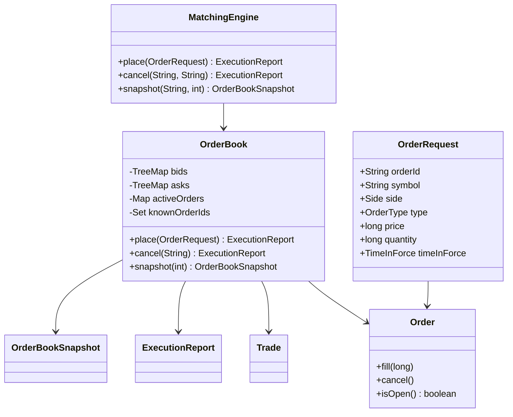
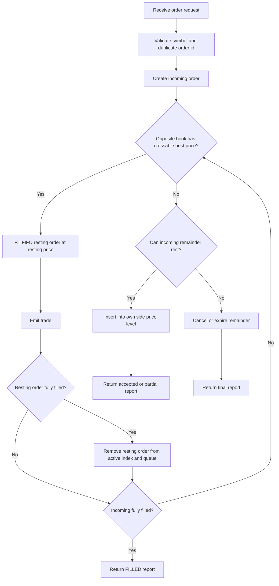

# Low-Level Design: Order Book

## Requirements

Functional requirements:

- Place limit orders.
- Place market orders.
- Match buy orders against the best ask and sell orders against the best bid.
- Preserve FIFO priority among orders at the same price.
- Support full fills and partial fills.
- Cancel active resting orders.
- Provide market-depth snapshots.

Non-functional requirements:

- Deterministic matching behavior.
- Integer price and quantity representation.
- Clear separation between matching logic and request routing.
- Simple extensibility for more order types or persistence later.

## Core Classes



## Data Structures

The order book stores two sorted maps:

- `bids`: `TreeMap` sorted descending by price.
- `asks`: `TreeMap` sorted ascending by price.

Each map points to a FIFO queue of orders:

```text
price -> [order1, order2, order3]
```

The active-order index maps:

```text
orderId -> Order
```

That index lets cancellation find an active order quickly. This version removes the order from its price-level queue with a linear scan. A production version should use linked-list nodes or intrusive queues to make cancellation constant time.

## Matching Flow



## Matching Rules

### Buy Limit

A buy limit order matches while:

```text
bestAsk <= buyLimitPrice
```

### Sell Limit

A sell limit order matches while:

```text
bestBid >= sellLimitPrice
```

### Market

A market order matches the best available opposite prices until either the incoming quantity is filled or opposite liquidity runs out. Any unfilled market quantity is cancelled because market orders do not rest.

### Price

The trade price is the resting order price. This is common matching-engine behavior because the resting order supplied liquidity at that price.

## Extension Points

- Add stop orders by introducing a trigger-order store before the active book.
- Add modify order by cancel-replace semantics to avoid changing priority accidentally.
- Add market data by publishing snapshots and trade events from `OrderBook.place`.
- Add persistence by appending accepted commands and generated trades to a journal.
- Add risk checks in `MatchingEngine.place` before routing to `OrderBook`.

## Limitations

- Single JVM process.
- Synchronized per-book mutation.
- Linear queue scan for cancellation.
- No self-trade prevention.
- No order amend/replace API.
- No durability or replay journal.
