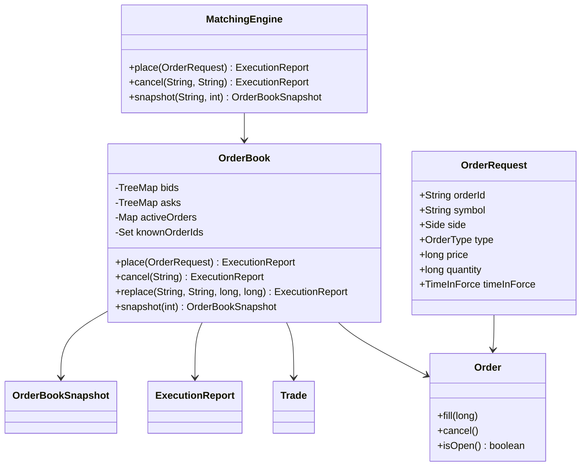
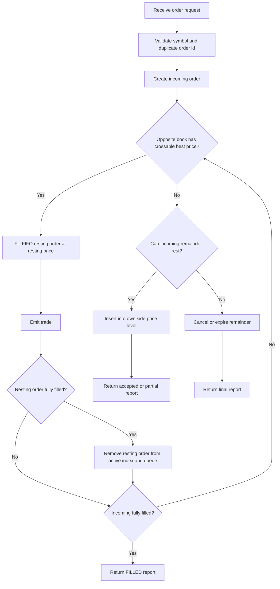

# Low-Level Design: Order Book

## 40–60 Minute Interview Route

- 0–8 min: clarify single/multi-symbol scope, supported commands, price/quantity units, and time-in-force.
- 8–20 min: draw the classes and identify `OrderBook` as the per-symbol aggregate.
- 20–35 min: choose two ordered maps plus FIFO queues and walk add/match/cancel/replace.
- 35–45 min: code `place`, `match`, and top-of-book; add cancel/replace if time permits.
- 45–55 min: state invariants, complexity, synchronization boundary, and deterministic ordering.
- 55–60 min: name tests and production extensions such as journaling, replay, self-trade prevention, and O(1) cancel handles.

## Requirements

Functional requirements:

- Place limit orders.
- Place market orders.
- Match buy orders against the best ask and sell orders against the best bid.
- Preserve FIFO priority among orders at the same price.
- Support full fills and partial fills.
- Cancel active resting orders.
- Replace active orders using cancel-replace semantics.
- Provide market-depth snapshots.

Non-functional requirements:

- Deterministic matching behavior.
- Integer price and quantity representation.
- Clear separation between matching logic and request routing.
- Simple extensibility for more order types or persistence later.

## Core Classes



## Data Structures

The order book stores two sorted maps:

- `bids`: `TreeMap` sorted descending by price.
- `asks`: `TreeMap` sorted ascending by price.

Each map points to a FIFO queue of orders:

```text
price -> [order1, order2, order3]
```

The active-order index maps:

```text
orderId -> Order
```

That index lets cancellation find an active order quickly. This version removes the order from its price-level queue with a linear scan. A production version should use linked-list nodes or intrusive queues to make cancellation constant time.

## Matching Flow



## Matching Rules

### Buy Limit

A buy limit order matches while:

```text
bestAsk <= buyLimitPrice
```

### Sell Limit

A sell limit order matches while:

```text
bestBid >= sellLimitPrice
```

### Market

A market order matches the best available opposite prices until either the incoming quantity is filled or opposite liquidity runs out. Any unfilled market quantity is cancelled because market orders do not rest.

### Price

The trade price is the resting order price. This is common matching-engine behavior because the resting order supplied liquidity at that price.

## Design Patterns

| Pattern | Where | Why it matters in interview discussion |
| --- | --- | --- |
| Facade | `MatchingEngine` | Exposes a symbol-aware API and hides per-symbol book creation. |
| Aggregate / Domain Model | `OrderBook` | Owns the mutable matching state for one symbol. |
| Value Object / DTO | `OrderRequest`, `Trade`, `ExecutionReport`, `OrderBookSnapshot`, `PriceLevel` | Keeps commands, events, responses, and read models explicit. |
| State Machine | `OrderStatus`, `Order.fill`, `Order.cancel` | Makes order lifecycle transitions explicit. |
| Ordered Data Structure Pattern | `TreeMap<Long, Deque<Order>>` | Encodes price priority with FIFO time priority at each price level. |

## Key Invariants

- Each symbol has exactly one `OrderBook` inside `MatchingEngine`.
- Resting bids are sorted high-to-low; resting asks are sorted low-to-high.
- FIFO order is preserved within the same price level.
- `activeOrders` contains only open resting orders.
- Market orders never rest.
- Filled or cancelled orders are removed from the active-order index.

## Replace Semantics

`replace(oldId, newId, price, quantity)` validates the replacement before changing the book. It then cancels the old order and submits a new GTC limit order. The replacement loses FIFO priority even if its price is unchanged. The supplied quantity is the new open quantity; already executed quantity remains part of the old order's history.

## Extension Points

- Add stop orders by introducing a trigger-order store before the active book.
- Add market data by publishing snapshots and trade events from `OrderBook.place`.
- Add persistence by appending accepted commands and generated trades to a journal.
- Add risk checks in `MatchingEngine.place` before routing to `OrderBook`.

## Interview Talking Points

- Matching is synchronized per book, so different symbols can progress independently through separate `OrderBook` instances.
- Cancellation is fast to locate through `activeOrders`, but removal from the price-level queue is linear.
- A production matching engine usually persists a command journal so the book can be replayed after restart.
- Integer price and quantity avoid floating-point rounding problems.

## Limitations

- Single JVM process.
- Synchronized per-book mutation.
- Linear queue scan for cancellation.
- No self-trade prevention.
- Replace is cancel-replace only; it does not preserve the original order ID or time priority.
- No durability or replay journal.
