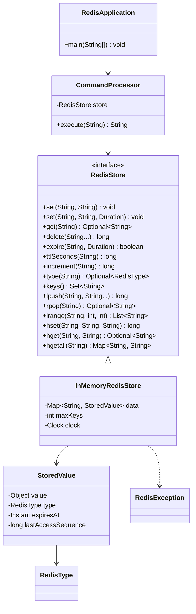
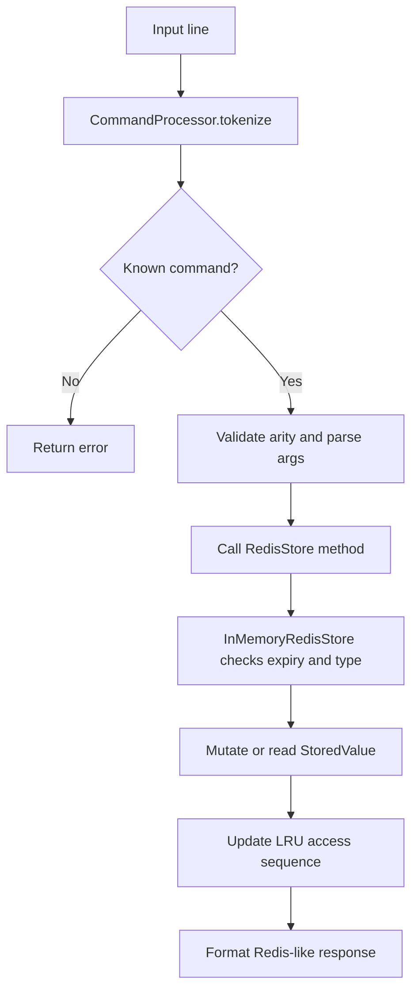

# Low-Level Design: DesignRedis

## Interview Scope

Design a small Redis-like in-memory key-value store with typed values, TTL expiry, command parsing, LRU eviction, and deterministic tests.

Functional requirements:

- Support strings, lists, and hashes.
- Support `SET`, `GET`, `DEL`, `EXPIRE`, `TTL`, `INCR`, `TYPE`, `KEYS`, `LPUSH`, `RPOP`, `LRANGE`, `HSET`, `HGET`, and `HGETALL`.
- Expire keys lazily when accessed.
- Enforce type safety between commands and stored values.
- Optionally cap the number of keys and evict least-recently-used entries.

Non-functional requirements:

- Atomic store operations.
- Clear API boundary for command execution.
- Deterministic clock-based expiry tests.
- Simple in-memory implementation suitable for LLD discussion.

## Core Class Diagram

## Main Responsibilities

| Component | Responsibility |
| --- | --- |
| `RedisStore` | Stable store API used by clients and command handlers. |
| `InMemoryRedisStore` | Owns key storage, expiry checks, LRU metadata, type validation, and mutations. |
| `StoredValue` | Wraps a typed value with TTL and access metadata. |
| `CommandProcessor` | Parses CLI-style commands, validates arity, delegates to `RedisStore`, and formats responses. |
| `RedisApplication` | Runs the interactive shell. |

## Command Flow

## Data Structures

| Need | Structure | Reason |
| --- | --- | --- |
| Key lookup | `HashMap<String, StoredValue>` | Average `O(1)` get and update. |
| Strings | `String` inside `StoredValue` | Simple scalar value. |
| Lists | `LinkedList<String>` | Efficient push/pop at ends. |
| Hashes | `LinkedHashMap<String, String>` | Deterministic iteration order for tests and output. |
| Key listing | Sorted copy of key set | Stable output for demos. |
| Eviction | `lastAccessSequence` on each `StoredValue` | Lets the store find the least recently used key when capacity is reached. |

## Design Patterns

| Pattern | Where | Why it matters in interview discussion |
| --- | --- | --- |
| Facade / Port | `RedisStore` | Clients depend on a narrow store contract, not the concrete in-memory data layout. |
| Command Dispatcher | `CommandProcessor` | Centralizes command parsing and maps text commands to typed store operations. |
| Wrapper / Value Object | `StoredValue` | Encapsulates payload type, expiry, and LRU metadata together. |
| Factory Method | `StoredValue.string`, `StoredValue.list`, `StoredValue.hash` | Keeps typed value construction consistent. |
| Exception Boundary | `RedisException` | Converts invalid command semantics into predictable CLI responses. |

## Consistency and Concurrency

`InMemoryRedisStore` synchronizes public methods. This gives a single atomic boundary for each command so type checks, expiry cleanup, LRU updates, and mutations cannot interleave incorrectly.

Tradeoffs:

- Simple and correct for an interview-sized in-memory store.
- Lower concurrency than per-key locking or striped locks.
- Long commands such as `KEYS` can block other operations.
- A production Redis-like system would use an event loop, sharding, replication, and persistence.

## Extension Points

- Extract an `EvictionPolicy` strategy for LRU, LFU, or random eviction.
- Add persistence by writing commands to an append-only log.
- Add pub/sub by publishing events after mutations.
- Add network transport around `CommandProcessor`.
- Add per-key locks or shards for higher concurrency.

## Interview Talking Points

- Lazy expiry keeps writes and background work simple, but expired keys may occupy memory until accessed or evicted.
- Type validation belongs near the storage engine because all clients must obey it.
- The command processor is intentionally separate from storage so protocol parsing does not leak into data structure code.
- `Clock` injection makes TTL tests deterministic.
