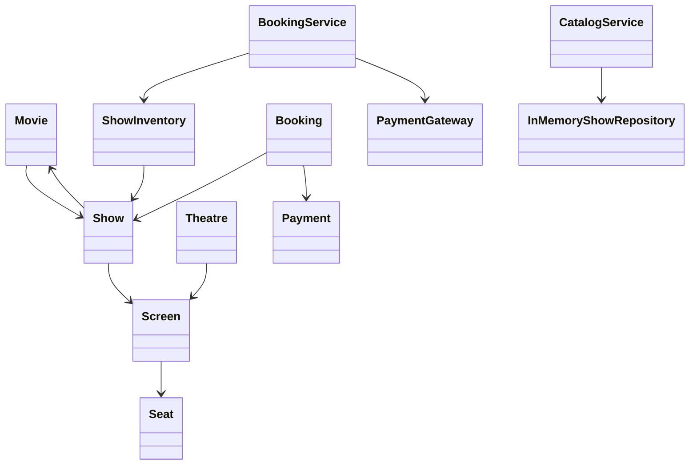

# BookMyShow Low-Level Design

This module models the core booking path for a BookMyShow-style application.
It is intentionally in-memory so the object model, service boundaries, and
seat-locking behavior are easy to inspect and test.

For interview prep, see [docs/LOW_LEVEL_DESIGN.md](docs/LOW_LEVEL_DESIGN.md) for the class diagram, booking sequence, design patterns, invariants, and production tradeoffs.

## Functional Scope

- Register movies, theatres, screens, and shows.
- Search shows by city, movie title, and date.
- Hold seats for a short time window before payment.
- Confirm bookings after payment.
- Release seats when a hold expires or a booking is cancelled.
- Prevent double-booking when multiple users choose the same seats.

## Core Objects



## Booking Flow

1. User searches shows by city, movie, and date.
2. User selects seats for a show.
3. `BookingService.holdSeats` locks that show's inventory and marks seats as
   `HELD` for the booking.
4. User pays before the hold expires.
5. `BookingService.confirmBooking` charges the payment gateway and marks the
   held seats as `BOOKED`.

## Concurrency Strategy

Each show owns its own `ShowInventory`, and each inventory has one lock. Seat
state changes for different shows can run in parallel, while conflicting
changes inside the same show are serialized. This is the key invariant:

```text
A seat can move AVAILABLE -> HELD -> BOOKED only while the show inventory lock is held.
```

In a production system this lock would usually be backed by database row locks,
optimistic versioning, Redis locks, or a short-lived reservation table with a
unique key on `(show_id, seat_id)`.

## Run Tests

```powershell
mvn test
```

## Run Demo

```powershell
mvn exec:java
```
