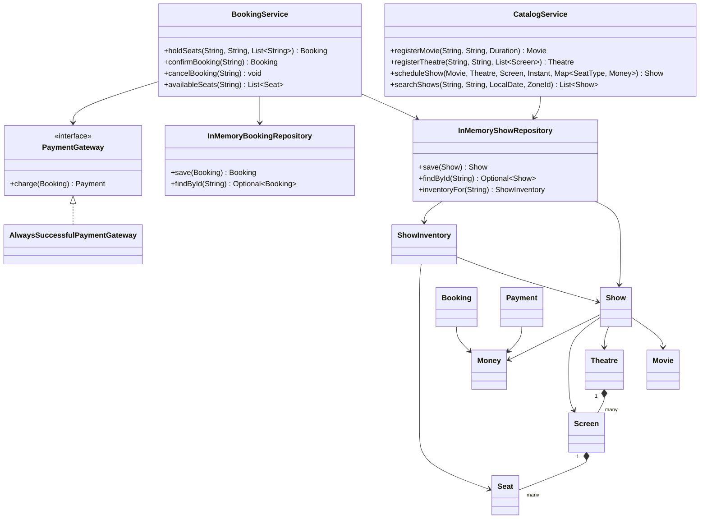
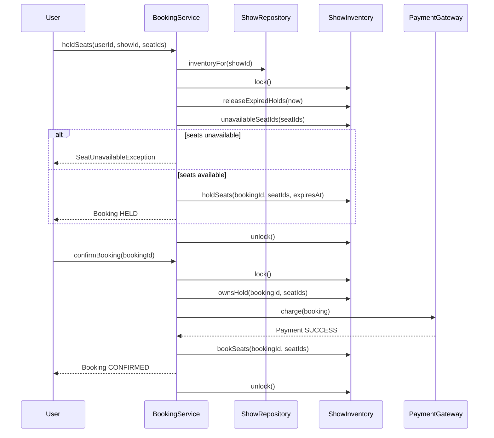

# Low-Level Design: BookMyShow

## Interview Scope

Design a movie-ticket booking service that lets users search shows, hold seats, confirm payment, cancel bookings, and avoid double-booking under concurrent seat selection.

Functional requirements:

- Register movies, theatres, screens, seats, and shows.
- Search shows by city, movie title, and date.
- Show available seats for a show.
- Temporarily hold seats while the user pays.
- Confirm, expire, or cancel a booking.
- Prevent two users from booking the same seat for the same show.

Non-functional requirements:

- Strong consistency for seat inventory.
- Deterministic behavior for tests and demos.
- Replaceable payment integration.
- Clear separation between catalogue and booking flows.
- In-memory repositories for the LLD exercise, with obvious production replacement points.

## Core Class Diagram

## Main Responsibilities

| Component | Responsibility |
| --- | --- |
| `CatalogService` | Creates catalogue entities and schedules shows. |
| `BookingService` | Coordinates seat holds, confirmation, cancellation, expiry, and payment. |
| `ShowInventory` | Owns mutable per-show seat state and the lock that protects it. |
| `Booking` | Tracks user, selected seats, amount, hold expiry, payment id, and lifecycle status. |
| `PaymentGateway` | Port for payment capture. The demo uses `AlwaysSuccessfulPaymentGateway`. |
| `InMemoryShowRepository` | Stores shows and one inventory object per show. |
| `InMemoryBookingRepository` | Stores booking records by booking id. |

## Booking Flow

## Design Patterns

| Pattern | Where | Why it matters in interview discussion |
| --- | --- | --- |
| Facade / Application Service | `CatalogService`, `BookingService` | Keeps workflows behind simple public methods instead of exposing internal repositories and locks. |
| Repository | `InMemoryShowRepository`, `InMemoryBookingRepository` | Hides storage details and gives a clean path to SQL or NoSQL persistence. |
| Adapter / Port | `PaymentGateway` | Payment providers can change without modifying booking rules. |
| Value Object | `Money`, `Movie`, `Seat`, `Screen`, `Show`, `Payment` | Immutable data carriers reduce accidental side effects. |
| State Machine | `BookingStatus`, `SeatStatus`, `ShowInventory.SeatState` | Makes lifecycle transitions explicit: available, held, booked, cancelled, expired. |

## Consistency and Concurrency

The critical consistency boundary is one `ShowInventory` per show. It owns a `ReentrantLock`, so two users can book different shows in parallel while conflicting operations on the same show serialize.

Important invariants:

- A seat belongs to a screen and is tracked once per show inventory.
- A seat can be held only when it is currently available or its prior hold has expired.
- A booking can confirm only if it still owns the hold for all requested seats.
- Expired holds are released before availability checks.
- Seat state changes happen while the show inventory lock is held.

Production alternatives:

- Database row locks on `(show_id, seat_id)`.
- Optimistic version columns for seat inventory rows.
- Redis-backed short-lived holds with a unique reservation key.
- A reservation table with TTL cleanup and uniqueness constraints.

## Extension Points

- Add seat pricing rules by extracting a `PricingStrategy`.
- Add multiple payment providers through more `PaymentGateway` implementations.
- Add booking notifications after `confirmBooking` succeeds.
- Add persistent repositories without changing the service-level API.
- Add idempotent payment confirmation by storing payment intent ids.

## Interview Talking Points

- The design chooses per-show locking because global locking would reduce concurrency and per-seat locking would make multi-seat atomicity harder.
- `ShowInventory` is the aggregate root for mutable seat state.
- Payment is called while the inventory lock is held in this demo to keep the model compact; in production, use a payment intent and finalize with a shorter transactional lock.
- Catalogue data is mostly immutable after show creation; inventory is the hot mutable object.
- The biggest scale challenges are hot shows, payment retries, and seat-hold expiry cleanup.
