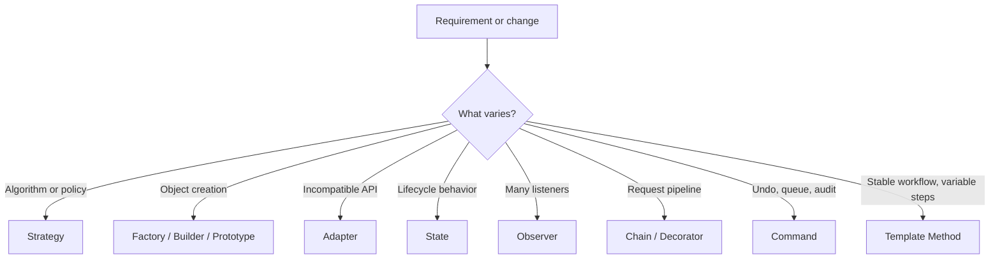

# Design Patterns for Low-Level Design Interviews

This chapter is a decision guide, not a pattern dictionary. A strong LLD answer does not maximize the number of patterns. It identifies what is likely to change, protects the important invariants, and uses the smallest design that keeps those changes local.

The chapter covers all 23 Gang of Four (GoF) patterns and the additional patterns that repeatedly appear in Java LLD interviews.

## 1. How to Think Before Naming a Pattern

Start with five questions:

1. **What behavior varies?** Pricing, allocation, validation, notification, creation, persistence, or an external provider?
2. **Who owns the state?** Identify the object that must protect each invariant.
3. **When is the choice made?** At compile time, object construction, configuration, or per request?
4. **What kind of coupling hurts?** Coupling to a concrete class, construction process, representation, workflow, or external API?
5. **Is a pattern actually needed?** One stable implementation usually needs a class, not an interface hierarchy.



### The interview rule

Explain every pattern as:

> **Problem -> pressure/change -> design -> trade-off -> extension**

Example: “Parking allocation rules will change independently of the parking workflow. I extract `SpotAllocationStrategy`, inject one implementation, and keep `ParkingLotService` focused on the park/unpark use case. This adds an interface and indirection, so I would not do it if there were only one stable rule. A reserved-spot policy becomes another strategy.”

## 2. Pattern Selection Cheat Sheet

| Interview signal | First candidate | Distinguish it from |
| --- | --- | --- |
| “Support multiple algorithms/rules” | Strategy | State changes behavior because lifecycle state changes; Strategy is selected policy |
| “Create families of matching objects” | Abstract Factory | Factory Method creates one product through an overridable method |
| “Construction has many optional/validated fields” | Builder | Factory hides which concrete type is returned |
| “Wrap a third-party API” | Adapter | Facade simplifies your own subsystem; Proxy preserves the same contract and controls access |
| “Add features dynamically” | Decorator | Chain chooses handlers; Decorator normally executes every wrapper |
| “Notify multiple consumers” | Observer | Mediator coordinates colleagues; event bus is a distributed/asynchronous variation |
| “Behavior depends on status” | State | Strategy generally does not represent lifecycle transitions |
| “Undo, queue, retry, audit an action” | Command | Strategy represents a calculation, not a first-class request |
| “Pass request through validators” | Chain of Responsibility | Decorator enriches behavior around one component |
| “Fixed algorithm with customizable steps” | Template Method | Strategy replaces the whole algorithm through composition |
| “Traverse without exposing storage” | Iterator | Visitor adds operations over a stable object structure |
| “Save and restore state” | Memento | Prototype copies an object for reuse/construction |
| “Complex subsystem needs one entry point” | Facade | Mediator manages ongoing peer-to-peer interaction |
| “Millions of similar objects” | Flyweight | Singleton controls instance count, not shared intrinsic state |
| “Tree of parts and groups” | Composite | Decorator wraps one object but does not primarily model a hierarchy |

## 3. Creational Patterns

Creational patterns separate **what the client needs** from **how objects are constructed**.

### 3.1 Singleton

**Intent:** Ensure one instance in a process and provide a global access point.

**Use when:** There is a genuinely process-wide coordinator or stateless registry whose single-instance invariant matters. Prefer dependency-injection container scope in Spring.

**Avoid when:** It is merely convenient global state. Singletons hide dependencies, complicate tests, and do not create a cluster-wide singleton.

```java
public enum MetricsRegistry {
    INSTANCE;
    private final Map<String, LongAdder> counters = new ConcurrentHashMap<>();
    public void increment(String name) {
        counters.computeIfAbsent(name, ignored -> new LongAdder()).increment();
    }
}
```

**Interview explanation:** Mention thread safety, serialization/reflection concerns, testability, and process versus distributed scope. Java `enum` is the safest language-level implementation; constructor injection is usually the cleaner application design.

### 3.2 Factory Method

**Intent:** Define a creation operation while allowing a subtype or implementation to decide the concrete product.

**Use when:** Clients should depend on a product interface and creation varies by type or environment.

```java
interface Notification { void send(String message); }

abstract class NotificationCreator {
    public final void notify(String message) { create().send(message); }
    protected abstract Notification create();
}
class EmailCreator extends NotificationCreator {
    protected Notification create() { return new EmailNotification(); }
}
```

**Judge carefully:** A static `NotificationFactory.create(Channel)` is often called a simple factory, not the GoF Factory Method. Say which one you mean.

**Trade-off:** Removes concrete construction from clients but can create many creator subclasses.

### 3.3 Abstract Factory

**Intent:** Create a family of related products without exposing their concrete classes.

```java
interface PaymentFamilyFactory {
    PaymentGateway gateway();
    RefundGateway refundGateway();
}
class StripeFactory implements PaymentFamilyFactory {
    public PaymentGateway gateway() { return new StripePaymentGateway(); }
    public RefundGateway refundGateway() { return new StripeRefundGateway(); }
}
```

**Use when:** Products must be compatible as a family—AWS versus Azure infrastructure adapters, Stripe versus Adyen payment components, light versus dark UI widgets.

**Factory Method vs Abstract Factory:** Factory Method is commonly inheritance plus one product creation hook. Abstract Factory is composition plus multiple related creation methods.

**Trade-off:** Swapping a family is easy; adding a new product kind changes every factory.

### 3.4 Builder

**Intent:** Construct a complex object step by step and make invalid combinations difficult.

```java
Order order = Order.builder()
        .customerId(customerId)
        .addItem(sku, 2)
        .shippingAddress(address)
        .build(); // validates required fields and invariants
```

**Use when:** Construction has many optional parameters, staged inputs, immutable output, or cross-field validation.

**Avoid when:** A constructor or named factory with three clear parameters is enough. Do not let a builder bypass domain invariants.

**Builder vs Factory:** Builder answers “how do I assemble this complex instance?” Factory answers “which concrete implementation should I create?” They can work together.

### 3.5 Prototype

**Intent:** Create an object by copying a configured exemplar.

```java
interface CampaignPrototype { Campaign copy(); }

record Campaign(String name, List<Rule> rules) implements CampaignPrototype {
    public Campaign copy() { return new Campaign(name, new ArrayList<>(rules)); }
}
```

**Use when:** Initialization is expensive or users clone templates/configurations.

**Key interview issue:** Define shallow versus deep copy. Mutable nested objects must be copied or deliberately shared. In Java, prefer explicit copy methods/copy constructors over `Cloneable`.

## 4. Structural Patterns

Structural patterns shape relationships among objects and interfaces.

### 4.1 Adapter

**Intent:** Convert an existing interface into the interface the domain expects.

```java
interface PaymentProcessor { PaymentResult charge(Money amount); }

final class StripePaymentAdapter implements PaymentProcessor {
    private final StripeClient client;
    public PaymentResult charge(Money amount) {
        StripeResponse response = client.createCharge(amount.minorUnits(), amount.currency());
        return new PaymentResult(response.id(), map(response.status()));
    }
}
```

**Use when:** Integrating legacy code, SDKs, providers, or incompatible models. Keep provider exceptions and DTOs behind the adapter boundary.

**Adapter vs Facade vs Proxy:** Adapter changes the contract. Facade offers a simpler contract. Proxy implements the same contract while controlling access.

### 4.2 Bridge

**Intent:** Split two independently varying dimensions into separate hierarchies connected by composition.

```java
interface MessageSender { void send(String recipient, String body); }
abstract class Notification {
    protected final MessageSender sender;
    protected Notification(MessageSender sender) { this.sender = sender; }
    abstract void notify(User user);
}
class UrgentNotification extends Notification { /* urgency varies */ }
class SmsSender implements MessageSender { /* channel varies */ }
```

**Use when:** Both abstraction and implementation vary, such as notification type x channel or shape x renderer.

**Bridge vs Adapter:** Bridge is designed up front to prevent a Cartesian-product hierarchy. Adapter repairs an interface mismatch after classes exist.

### 4.3 Composite

**Intent:** Treat individual objects and groups uniformly in a tree.

```java
interface FileNode { long size(); }
record FileLeaf(long size) implements FileNode {}
record Directory(List<FileNode> children) implements FileNode {
    public long size() { return children.stream().mapToLong(FileNode::size).sum(); }
}
```

**Use when:** File systems, organization charts, menus, expression trees, product bundles.

**Trade-off:** Recursive algorithms become simple, but a very broad component interface may permit operations meaningless for some leaves.

### 4.4 Decorator

**Intent:** Add responsibilities by wrapping an object that implements the same contract.

```java
interface DataSource { byte[] read(); void write(byte[] data); }
final class EncryptingDataSource implements DataSource {
    private final DataSource delegate;
    public void write(byte[] data) { delegate.write(encrypt(data)); }
    public byte[] read() { return decrypt(delegate.read()); }
}
```

**Use when:** Logging, caching, compression, metrics, authorization, or optional features must compose dynamically.

**Decorator vs inheritance:** Decorator combines features at runtime without subclass explosion. The cost is wrapper ordering and harder debugging.

### 4.5 Facade

**Intent:** Provide a small, workflow-oriented API over a complex subsystem.

```java
final class CheckoutFacade {
    Receipt checkout(Cart cart) {
        inventory.reserve(cart);
        Payment payment = payments.charge(cart.total());
        Shipment shipment = shipping.create(cart);
        return receipts.create(payment, shipment);
    }
}
```

**Use when:** Controllers or clients otherwise orchestrate many components. An application service is often a facade.

**Warning:** A facade should coordinate; it should not become a god object containing every domain rule.

### 4.6 Flyweight

**Intent:** Share immutable intrinsic state across many logical objects; keep context-specific extrinsic state outside.

```java
record TreeType(String name, Color color, Texture texture) {}
record PlacedTree(int x, int y, TreeType sharedType) {}
```

**Use when:** Profiling shows memory pressure from huge numbers of similar objects—characters/glyphs, map tiles, game objects.

**Interview test:** Clearly name intrinsic shared state and extrinsic per-instance state. Do not introduce it without a measurable scale reason.

### 4.7 Proxy

**Intent:** Stand in for another object using the same interface and control access to it.

```java
final class CachingCatalogProxy implements Catalog {
    private final Catalog remote;
    private final Map<String, Product> cache = new ConcurrentHashMap<>();
    public Product find(String id) { return cache.computeIfAbsent(id, remote::find); }
}
```

**Variants:** Virtual/lazy proxy, remote proxy, protection proxy, caching proxy.

**Proxy vs Decorator:** Both wrap. A proxy controls access or lifecycle; a decorator deliberately adds a feature. Intent is the deciding factor.

## 5. Behavioral Patterns

Behavioral patterns organize algorithms, communication, requests, and lifecycle behavior.

### 5.1 Chain of Responsibility

**Intent:** Pass a request through an ordered set of handlers until one handles it or all contribute.

```java
interface FraudRule { Optional<Reason> evaluate(Transaction tx); }
final class FraudRuleChain {
    private final List<FraudRule> rules;
    List<Reason> evaluate(Transaction tx) {
        return rules.stream().map(r -> r.evaluate(tx)).flatMap(Optional::stream).toList();
    }
}
```

**Use when:** Validation pipelines, middleware, approval levels, fraud/risk rules.

**Design decision:** State whether processing stops at the first match or aggregates every result. Make ordering explicit and test it.

### 5.2 Command

**Intent:** Represent a request as an object.

```java
interface Command { void execute(); void undo(); }
final class ReserveSeatCommand implements Command {
    public void execute() { seats.reserve(showId, seatId); }
    public void undo() { seats.release(showId, seatId); }
}
```

**Use when:** Queuing, scheduling, audit history, retries, undo, macro operations.

**Command vs DTO:** A command carries intent and normally has a handler/behavior; a DTO merely transports data. In distributed systems, make execution idempotent because retries happen.

### 5.3 Interpreter

**Intent:** Model a grammar and evaluate expressions in that language.

```java
sealed interface Expression permits And, Equals {
    boolean evaluate(Context context);
}
record And(Expression left, Expression right) implements Expression {
    public boolean evaluate(Context c) { return left.evaluate(c) && right.evaluate(c); }
}
```

**Use when:** A small, stable DSL such as filters, eligibility rules, or search expressions.

**Avoid when:** Grammar is complex. Use a parser generator or established expression engine; recursive class trees become hard to maintain.

### 5.4 Iterator

**Intent:** Traverse a collection without exposing its representation.

```java
final class Playlist implements Iterable<Song> {
    public Iterator<Song> iterator() { return songs.iterator(); }
}
```

**Use when:** A custom aggregate needs stable traversal, filtering, lazy traversal, or multiple traversal strategies.

**Java note:** Know `Iterable<T>` and `Iterator<T>`; do not reinvent them unless the interview requires a custom traversal such as BFS over a composite.

### 5.5 Mediator

**Intent:** Centralize complex interaction among peer objects so they do not reference one another directly.

```java
interface AuctionMediator { void bid(Bidder bidder, Money amount); }
final class AuctionRoom implements AuctionMediator {
    public void bid(Bidder bidder, Money amount) { /* validate and notify peers */ }
}
```

**Use when:** Chat rooms, UI controls, auction participants, air-traffic coordination.

**Mediator vs Facade:** Facade is a client-facing doorway into a subsystem. Mediator actively coordinates communication among colleagues and can become a god object if responsibilities are not split.

### 5.6 Memento

**Intent:** Capture internal state so it can later be restored without exposing representation.

```java
record EditorMemento(String text, int cursor) {}
final class Editor {
    EditorMemento save() { return new EditorMemento(text, cursor); }
    void restore(EditorMemento m) { text = m.text(); cursor = m.cursor(); }
}
```

**Use when:** Undo, checkpoints, game saves, draft restoration.

**Trade-off:** Snapshots can consume memory; mutable references can corrupt history. Consider deltas or event sourcing for long histories.

### 5.7 Observer

**Intent:** Notify multiple subscribers when a subject changes.

```java
interface OrderListener { void onStatusChanged(OrderEvent event); }
final class Order {
    private final List<OrderListener> listeners = new CopyOnWriteArrayList<>();
    void changeStatus(OrderStatus next) {
        transitionTo(next);
        listeners.forEach(listener -> listener.onStatusChanged(event()));
    }
}
```

**Use when:** UI updates, domain notifications, local event handling.

**Critical interview details:** Synchronous or asynchronous? What if a listener fails? How are listeners removed? Is ordering guaranteed? In distributed systems, a broker plus transactional outbox addresses different reliability concerns than an in-memory observer.

### 5.8 State

**Intent:** Delegate behavior to an object representing the current lifecycle state.

```java
interface OrderState { void pay(Order context); void cancel(Order context); }
final class CreatedState implements OrderState {
    public void pay(Order order) { order.transitionTo(new PaidState()); }
    public void cancel(Order order) { order.transitionTo(new CancelledState()); }
}
```

**Use when:** Many operations behave differently by state and `if/switch` logic is spreading across methods.

**State vs enum:** An enum plus guarded transitions is simpler for a small lifecycle. Promote states to classes when each state owns meaningful behavior. State is not a license to allow arbitrary transitions.

### 5.9 Strategy

**Intent:** Encapsulate interchangeable algorithms behind one contract.

```java
interface PricingStrategy { Money price(Booking booking); }
final class WeekendPricing implements PricingStrategy { /* ... */ }
final class SurgePricing implements PricingStrategy { /* ... */ }
```

**Use when:** Pricing, sorting, allocation, routing, scoring, retry, or scheduling policy varies.

**Strategy vs State:** The client/configuration selects a strategy to achieve a policy. A context transitions between states as its lifecycle changes. Both use composition; intent differs.

### 5.10 Template Method

**Intent:** A base class fixes an algorithm’s sequence while subclasses customize selected steps.

```java
abstract class ImportJob {
    public final void run() { validate(); List<Row> rows = parse(); persist(rows); report(); }
    protected abstract List<Row> parse();
    protected void validate() {}
    protected abstract void persist(List<Row> rows);
    protected void report() {}
}
```

**Use when:** Sequence and invariants are stable, while a few steps vary.

**Template Method vs Strategy:** Template Method uses inheritance and controls step order. Strategy uses composition and swaps a whole algorithm. Prefer composition when runtime replacement or independent testing matters.

### 5.11 Visitor

**Intent:** Add operations to a stable object structure without putting every operation into its element classes.

```java
interface ShapeVisitor<R> { R visit(Circle c); R visit(Rectangle r); }
interface Shape { <R> R accept(ShapeVisitor<R> visitor); }
```

**Use when:** Element types are stable but operations grow—AST analysis, export formats, tax/report calculations across a fixed hierarchy.

**Trade-off:** Adding an operation is easy; adding an element type changes every visitor. Pattern matching on sealed types may be simpler in modern Java for small hierarchies.

## 6. Practical LLD Patterns Beyond the GoF 23

### 6.1 Repository

Presents collection-like access to aggregates while hiding persistence details.

```java
interface OrderRepository {
    Optional<Order> findById(OrderId id);
    void save(Order order);
}
```

Keep business decisions in the domain/application layer, not in controllers or persistence mappings. Avoid a generic repository that erases meaningful aggregate-specific queries.

### 6.2 Dependency Injection

Supply dependencies from outside rather than constructing them inside business classes.

```java
final class BookingService {
    BookingService(SeatRepository seats, PaymentProcessor payments, Clock clock) { /* ... */ }
}
```

Constructor injection makes dependencies visible, supports immutability, and makes tests straightforward. A DI container is a composition tool, not the reason to create interfaces for every class.

### 6.3 Value Object

An immutable object defined by its value rather than identity.

```java
record Money(BigDecimal amount, Currency currency) {
    Money { requireNonNull(amount); requireNonNull(currency); }
    Money add(Money other) { /* enforce same currency */ }
}
```

Use for money, date ranges, email addresses, coordinates, and identifiers. Validate at construction so invalid values cannot circulate.

### 6.4 Entity and Aggregate

An **entity** has continuity through identity. An **aggregate** is a consistency boundary with one root controlling mutations.

Example: `Order` is the aggregate root; callers add lines through `order.addItem(...)` rather than mutating `OrderLine` lists directly. Keep an aggregate only as large as the invariants requiring one atomic consistency boundary.

### 6.5 Specification

Represent a composable business predicate as an object.

```java
interface Specification<T> {
    boolean isSatisfiedBy(T value);
    default Specification<T> and(Specification<T> other) {
        return value -> isSatisfiedBy(value) && other.isSatisfiedBy(value);
    }
}
```

Use for reusable eligibility/search rules. Strategy usually calculates or chooses a behavior; Specification answers whether a candidate satisfies a rule.

### 6.6 Null Object

Provide a safe do-nothing implementation instead of repeated null checks—for example `NoOpMetrics` or `NoDiscount`.

Use only when “do nothing” is valid domain behavior. Do not hide missing mandatory configuration or unexpected absence.

### 6.7 Object Pool

Reuse expensive, constrained resources such as database connections or threads. Borrow, validate, and always return resources, normally through `try/finally` or `AutoCloseable`.

Do not pool cheap domain objects. Use a proven library for concurrency, timeouts, leak detection, and health checks.

### 6.8 Service Layer / Application Service

Coordinates a use case, transaction, repositories, domain objects, and external ports. It should be thin in domain decisions but explicit about workflow.

```java
@Transactional
public BookingId book(BookSeats command) {
    Show show = shows.get(command.showId());
    Booking booking = show.reserve(command.seats(), command.customerId());
    bookings.save(booking);
    events.publish(booking.events());
    return booking.id();
}
```

### 6.9 Ports and Adapters

The core defines ports such as `PaymentProcessor`, `Clock`, or `BookingRepository`; infrastructure supplies adapters. This is an architectural application of Dependency Inversion and Adapter.

Use it to keep SDKs, frameworks, databases, and HTTP concerns outside domain rules. Do not create ceremonial layers without a boundary worth protecting.

### 6.10 Event-Driven Patterns

- **Domain Event:** A fact that already happened, such as `BookingConfirmed`.
- **Transactional Outbox:** Persist state and an event record atomically, then publish later.
- **Idempotent Consumer:** Track event/message identity so redelivery is safe.
- **Saga:** Coordinate a multi-service business process with local transactions and compensations.

These solve distributed reliability problems; an in-memory Observer does not. During an LLD interview, state whether the design is single-process or distributed before using them.

### 6.11 CQRS and Event Sourcing

**CQRS** separates write and read models when their needs differ materially. **Event Sourcing** stores the event history as the source of truth and reconstructs state by replay.

They are independent patterns and add operational complexity. Use only when audit/history, temporal queries, write semantics, or read scaling justify them—not for an ordinary CRUD interview.

## 7. High-Value Comparisons

### Strategy, State, and Template Method

| Question | Strategy | State | Template Method |
| --- | --- | --- | --- |
| What varies? | Entire policy/algorithm | Behavior by lifecycle state | Selected steps in fixed workflow |
| Selection | Client/configuration | Context transitions itself | Subclass at construction |
| Mechanism | Composition | Composition | Inheritance |
| Example | Pricing policy | Booking status | File import skeleton |

### Adapter, Facade, Proxy, and Decorator

| Pattern | Contract | Primary intent |
| --- | --- | --- |
| Adapter | Changes it | Make incompatible APIs fit |
| Facade | Creates a simpler one | Hide subsystem complexity |
| Proxy | Preserves it | Control access/lifecycle/location |
| Decorator | Preserves it | Add composable behavior |

### Factory, Abstract Factory, Builder, and Prototype

| Need | Choose |
| --- | --- |
| Select one concrete product | Factory / Factory Method |
| Produce compatible product families | Abstract Factory |
| Assemble one complex validated object | Builder |
| Copy a preconfigured instance | Prototype |

### Observer, Mediator, and Event Bus

- Observer creates one-to-many notification, often in process.
- Mediator owns coordination rules among peer objects.
- An event bus/broker decouples publishers and consumers in time/location, but introduces delivery, ordering, schema, and observability concerns.

### Chain, Decorator, and Pipeline

- Chain may stop when one handler accepts the request, or deliberately aggregate handlers.
- Decorator wraps one component and enriches the same operation.
- A pipeline transforms output of one stage into input of the next; its stages usually all execute.

## 8. Applying Patterns to Common LLD Problems

| Problem | Likely patterns | Why |
| --- | --- | --- |
| Parking lot | Strategy, Factory, State, Facade | Allocation/pricing vary; tickets and spots have lifecycles |
| Elevator | Strategy, State, Observer | Dispatch policy varies; car state changes; displays observe |
| BookMyShow | Repository, State, Strategy, Adapter | Seat/booking consistency, pricing, payment boundary |
| Splitwise | Strategy, Value Object, Repository | Split calculation varies; money requires invariants |
| Vending machine | State, Strategy, Factory | Behavior by state; change selection; product creation |
| Logger | Chain, Strategy, Singleton/DI | Levels/sinks/formatting, but avoid global mutable singleton |
| Notification service | Strategy, Factory, Adapter, Decorator | Channel choice, providers, retry/metrics wrappers |
| Cache | Strategy, Decorator, Observer | Eviction policy, cached wrapper, invalidation notifications |
| Chess | State, Command, Strategy, Memento | game state, moves, player/AI choice, undo snapshots |
| File system | Composite, Iterator, Visitor | tree structure, traversal, operations over nodes |

These are hypotheses, not mandatory pattern inventories. Requirements decide the final design.

## 9. A 45-Minute Interview Workflow

### Minutes 0-5: Clarify

- Actors, top use cases, inputs/outputs.
- Scale and concurrency expectations.
- In-scope and out-of-scope features.
- Persistence and external-system assumptions.

### Minutes 5-12: Model

- Identify entities, value objects, lifecycle states, and aggregate boundaries.
- Write 2-4 invariants: “a seat has at most one active hold”; “money currencies must match.”

### Minutes 12-20: Assign responsibilities

- Put behavior next to the state it protects.
- Use an application service/facade to coordinate the use case.
- Define ports for external systems.

### Minutes 20-30: Introduce only justified patterns

Say the change explicitly before the pattern: “pricing varies, therefore Strategy.” Draw interfaces only where substitution is real.

### Minutes 30-40: Code the critical path

Code in this order:

1. Value objects and domain types.
2. Aggregate behavior and transition guards.
3. One variability interface and one implementation.
4. Application service workflow.
5. One happy-path test and one invariant/failure test.

### Minutes 40-45: Stress and extend

Discuss concurrent calls, transaction boundary, idempotency, failure recovery, and how one new requirement fits without rewriting the core.

## 10. How to Code Patterns Without Overengineering

### Start concrete, extract at the variation point

```java
final class ParkingService {
    private final SpotAllocationStrategy allocation; // real variation
    private final Clock clock;                        // nondeterministic boundary
    // ParkingTicket need not have an interface.
}
```

### Protect invariants inside the owner

```java
final class Booking {
    private BookingStatus status = BookingStatus.PENDING;

    void confirm(PaymentId paymentId) {
        if (status != BookingStatus.PENDING) {
            throw new IllegalStateException("Only pending bookings can be confirmed");
        }
        this.paymentId = requireNonNull(paymentId);
        this.status = BookingStatus.CONFIRMED;
    }
}
```

### Test contracts, not class names

```java
@Test
void cannot_confirm_an_already_cancelled_booking() {
    Booking booking = pendingBooking();
    booking.cancel();
    assertThrows(IllegalStateException.class, () -> booking.confirm(paymentId));
}
```

For a Strategy, test each implementation against shared behavioral cases. For State, test allowed and forbidden transitions. For Observer, test failure policy and unsubscribe behavior. For Adapter, test mapping at the boundary.

## 11. Common Interview Mistakes

1. **Pattern dumping:** Naming five patterns without a requirement or variation point.
2. **Interface for every class:** Interfaces are for boundaries/substitution, not decoration.
3. **Anemic domain model:** Services mutate public setters while entities protect no invariants.
4. **God service/facade:** One class owns orchestration, algorithms, persistence, validation, and formatting.
5. **State represented only by booleans:** `isPaid`, `isCancelled`, and `isShipped` permit impossible combinations.
6. **Ignoring concurrency:** Two callers can reserve the same seat/spot even if the class diagram looks elegant.
7. **Confusing in-memory and distributed guarantees:** `synchronized` protects one JVM, not many service instances.
8. **Forcing inheritance:** Prefer composition unless the relationship is truly stable and substitutable.
9. **No failure semantics:** Payment timeout, observer failure, retry, and partial completion must have an explicit policy.
10. **Premature distributed patterns:** CQRS, Saga, and Event Sourcing need a demonstrated reason.

## 12. Pattern Quality Checklist

Before presenting a pattern, verify:

- Can I name the concrete requirement or expected change that justifies it?
- Is each class responsible for one coherent concept?
- Are domain invariants enforced at the mutation boundary?
- Does the abstraction reduce harmful coupling?
- Can a new implementation be added without editing stable workflow code?
- Is behavior deterministic and testable (`Clock`, IDs, gateways injected where needed)?
- Have I stated ordering, concurrency, failure, and transaction assumptions?
- Is the simpler alternative inadequate for a reason I can explain?

## 13. Reusable Interview Answer Template

> “The core invariant is **[invariant]**, owned by **[class/aggregate]**. The behavior likely to vary is **[variation]**, so I use **[pattern]** through **[interface]**. The application service coordinates **[workflow]**, while **[adapter/repository]** isolates **[external concern]**. The trade-off is **[indirection/classes/ordering/complexity]**. If **[new requirement]** arrives, I add **[implementation]** without changing **[stable core]**. For concurrency I use **[lock/version/transaction/unique constraint]**, and I test **[critical invariant and failure case]**.”

The best interview design is not the one with the most patterns. It is the one whose responsibilities, invariants, variation points, and trade-offs are easiest to defend.
