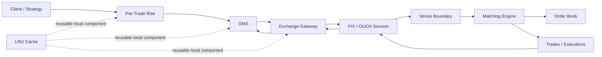

# Trading Projects: Relationship, Redundancy, and Study Guide

## Why this guide exists

The workspace intentionally contains the same trading concepts at different levels of abstraction. That is useful only when each project has a clear job:

- `G:\TechStudyNotes\LLDProjects` contains isolated designs that can be explained and substantially coded in a 40–60 minute LLD interview.
- `G:\TechStudyNotes\SystemDesignProjects` contains integrated, production-shaped systems used to discuss service boundaries, durability, recovery, operations, and scale.

The folders should remain separate. Do not merge an interview module into a production-shaped project merely because both contain an `Order`, `RiskRule`, or `SessionManager`.

## The two-lane rule

| Lane | Primary question | Expected output | Deliberately excluded |
| --- | --- | --- | --- |
| One-hour LLD | “Which classes, APIs, state, and data structures solve this problem?” | Requirements, class diagram, core code, invariants, complexity, tests, and production follow-ups | Deployment, databases, network servers, dashboards, broad infrastructure |
| Production-shaped system design | “How does this survive concurrency, failure, restart, scale, and operations?” | Service/component boundaries, durable state, idempotency, recovery, observability, security, capacity, deployment, and failure drills | Full certification or claims unsupported by live verification |

“Production-shaped” is more accurate than “production-ready.” A learning project is not production-ready merely because it has Docker, Kubernetes, persistence, or many modules. Production readiness requires workload-specific testing, security review, protocol conformance, operational ownership, and proven recovery.

## End-to-end relationship



The OMS, gateway, and session manager are normally client/broker-side components. The matching engine and order book are venue-side components. The risk engine may exist on both sides with different policies. The LRU cache is a reusable component rather than a trading stage.

## Canonical one-hour LLD projects

Use one canonical project for each interview question. Other projects may contain similar classes, but they are supporting references rather than competing answers.

| # | Interview question | Canonical project | What to implement during the interview | State as follow-up |
| --- | --- | --- | --- | --- |
| 19 | Order Book | [DesignOrderBook](../DesignOrderBook/README.md) | Bid/ask maps, FIFO price levels, add, cancel, cancel-replace, partial fill, best bid/ask | O(1) cancel handles, journal/replay, self-trade prevention, advanced order types |
| 20 | Matching Engine | [matching-engine](../matching-engine/README.md) | Market/limit matching, price-time priority, maker-price trades, partial fills | IOC/FOK, auctions, partitioning, persistence, deterministic recovery |
| 21 | Pre-Trade Risk | [pre-trade-risk-engine](../pre-trade-risk-engine/README.md) | Pluggable rules for quantity, notional, exposure, price deviation, and kill switch | Atomic exposure reservation, stale-data policy, portfolio risk, configuration audit |
| 22 | OMS | [order-management-system](../order-management-system/README.md) | Lifecycle state machine, acknowledgements, fills, cancel/replace, invalid transitions | Execution deduplication, durable event journal, reconciliation, optimistic concurrency |
| 23 | FIX Session | [fix-session-manager](../fix-session-manager/README.md) | Logon, heartbeat, sequences, resend, duplicate detection, replay, reconnect state | TestRequest, GapFill/SequenceReset, durable raw-message store, session calendar |
| 24 | Exchange Gateway | [exchange-gateway](../exchange-gateway/README.md) | Protocol adapter, throttling, ack/execution mapping, disconnected queue and reconnect flush | Sent-but-unacknowledged reconciliation, bounded queues, cancel priority, conformance |
| 25 | LRU Cache | [lru-cache](../lru-cache/README.md) | Hash map plus doubly linked list, `O(1)` operations, eviction, lock boundary | TTL, weighted capacity, admission policy, segmentation, async loading |

## What should be coded in 40–60 minutes

The goal is a coherent vertical slice, not every production feature.

### 0–8 minutes: clarify

- Functional commands and outputs.
- Core invariants and invalid cases.
- Single-process and concurrency assumptions.
- Units: integer price, quantity, sequence number, or capacity.
- Explicit non-goals.

### 8–20 minutes: model

- Draw 4–7 important classes or interfaces.
- Identify the aggregate that owns mutable state.
- Choose data structures that encode the required ordering or lookup behavior.
- Mark extension seams such as Strategy, Adapter, Repository, or event listener.

### 20–45 minutes: implement the critical path

- Implement one end-to-end happy path.
- Add the most important rejection/invalid transition.
- Preserve invariants inside one clear mutation boundary.
- Prefer deterministic, in-memory behavior that can be tested without infrastructure.

### 45–55 minutes: prove it

- Walk through complexity.
- Name race conditions and the chosen thread-safety boundary.
- Add 2–4 tests for ordering, partial progress, invalid input, and an edge case.

### 55–60 minutes: scale the discussion

- Explain persistence, recovery, idempotency, metrics, and partitioning as extensions.
- Do not start implementing infrastructure at the end of the interview.

## Production-shaped counterparts

After learning the isolated LLD, use the corresponding integrated project to understand what changes when failures and operations matter.

| Concern | Production-shaped learning project | Relationship to the one-hour LLD |
| --- | --- | --- |
| Venue engine, order book, matching, binary ingress, control plane | [ExchangeLite](../../SystemDesignProjects/exchange-lite/README.md) | Integrates Order Book and Matching Engine with sessions, IPC, metrics, shutdown, and operational artifacts. |
| Risk, exposure, atomic reservation, services and failure drills | [Trading Risk Platform](../../SystemDesignProjects/trading-risk-platform/README.md) | Extends the risk-rule LLD into state ownership, persistence, race handling, service calls, audit, and operations. |
| Multi-venue FIX/OUCH connectivity and uncertain outcomes | [Exchange Connectivity Platform](../../SystemDesignProjects/exchange-connectivity-platform/README.md) | Extends Exchange Gateway plus FIX Session into durable sequences, gaps, fencing, throttling, deduplication, and sent-but-unacknowledged recovery. |
| Complete order-to-execution lifecycle | [Electronic Trading Platform](../../SystemDesignProjects/electronic-trading-platform/README.md) | Integrates risk, OMS, connectivity, executions, positions, journal replay, and observability in one inspectable vertical slice. |
| General distributed-order reliability | [Reliable Order Platform](../../SystemDesignProjects/reliable-order-platform/README.md) | Not a trading OMS replacement; use it to study idempotency, transactions, outbox, Kafka, authorization, and operational deployment patterns. |

## Existing overlap and how to treat it

### Intentional overlap

Overlap is healthy when at least one of these is true:

- The abstraction level differs: isolated LLD versus integrated system design.
- The ownership boundary differs: client OMS/gateway versus venue matching engine.
- One project teaches the algorithm while another teaches failure recovery.
- The small project stays self-contained so it can be coded and tested during an interview.

Do not extract a shared trading-domain library across the seven LLD modules. Repeated small enums and records are intentional: each interview answer should compile and make sense independently.

### Accidental or confusing overlap

Overlap becomes harmful when two projects claim to be the canonical answer to the same question at the same depth, or when copied behavior evolves inconsistently.

Current decisions:

- [fix-gateway](../fix-gateway/README.md) is a useful older integrated FIX gateway example. It is not the canonical answer for Pre-Trade Risk, FIX Session Manager, or Exchange Gateway; use the three focused modules above.
- `DesignOrderBook` contains a matching facade because an order book must demonstrate trades. For a Matching Engine question, use `matching-engine`; for an Order Book question, focus on price levels, active-order lookup, cancel/replace, and top-of-book.
- [DesignRedis](../DesignRedis/README.md) demonstrates LRU as one policy inside a larger Redis-like store. For the LRU Cache question, use `lru-cache`, which exposes the canonical `O(1)` map-plus-linked-list design.
- `reliable-order-platform` teaches durable business-order processing. It is not a trading OMS, though its idempotency and outbox patterns are valid production follow-ups.

## Should the folders be physically reorganized?

No immediate move is recommended. The current top-level separation already expresses the most important boundary:

```text
G:\TechStudyNotes
├── LLDProjects
│   ├── DesignOrderBook
│   ├── matching-engine
│   ├── pre-trade-risk-engine
│   ├── order-management-system
│   ├── fix-session-manager
│   ├── exchange-gateway
│   └── lru-cache
└── SystemDesignProjects
    ├── exchange-lite
    ├── trading-risk-platform
    ├── exchange-connectivity-platform
    ├── electronic-trading-platform
    └── reliable-order-platform
```

Moving or merging now would break stable paths, obscure Git history, and couple interview exercises to infrastructure. Use documentation and canonical labels as the organization layer.

For future projects, prefer kebab-case names, but do not rename `DesignOrderBook` or `DesignRedis` solely for cosmetic consistency.

## When an LLD project should graduate

Keep a feature in `LLDProjects` when it can be understood without external infrastructure and directly supports the named interview question. Promote or reimplement it in `SystemDesignProjects` when the learning objective becomes one of these:

- Durable recovery after process or machine failure.
- Cross-service consistency or distributed transactions.
- Real network protocols and compatibility/conformance.
- Horizontal partitioning, failover, leases, or leader fencing.
- Authentication, authorization, secrets, and audit retention.
- Capacity planning, SLOs, backpressure, observability, deployment, or on-call operations.

Do not continually enlarge the LLD version after promotion. Keep it as the minimal reference and link to the production-shaped counterpart.

## Production-readiness checklist

A project should not be described as production-ready until the relevant items are designed, implemented, and verified:

| Area | Evidence required |
| --- | --- |
| Correctness | Domain invariants, property/edge tests, overflow and invalid-input handling |
| Concurrency | Defined ownership, race tests, atomic reservations/transitions, load behavior |
| Durability | Write ordering, restart recovery, replay, backups and tested restore |
| Idempotency | Duplicate commands/events, retries, stable correlation IDs, reconciliation |
| Protocols | Real codecs, timeouts, schema/version compatibility, conformance testing |
| Resilience | Bounded queues, backpressure, circuit breaking, failover and failure drills |
| Security | Authentication, authorization, encryption, secret rotation, audit and threat review |
| Observability | Metrics, structured logs, tracing, SLOs, alerts and actionable dashboards |
| Operations | Repeatable deployment, rollback, migrations, runbooks and ownership |
| Performance | Representative benchmarks, capacity limits, latency percentiles and soak tests |

Docker or Kubernetes configuration alone satisfies none of these categories.

## Recommended study order

1. LRU Cache — practice data-structure ownership and invariants.
2. Order Book — ordered maps, FIFO queues, cancel/replace, partial mutation.
3. Matching Engine — deterministic price-time processing.
4. Pre-Trade Risk — Strategy rules and snapshot consistency.
5. OMS — explicit state transitions and racing events.
6. FIX Session Manager — protocol state, sequencing, replay, recovery.
7. Exchange Gateway — adapters, throttling, transport failure, event translation.
8. ExchangeLite — venue-side integration.
9. Trading Risk Platform and Exchange Connectivity Platform — production failure modes.
10. Electronic Trading Platform — complete lifecycle and recovery story.

## Quick selection rule

```text
Asked for classes, APIs, state machine, or data structure?
    -> Start in LLDProjects and keep the answer within one hour.

Asked for scale, persistence, failover, deployment, or operations?
    -> Start in SystemDesignProjects.

Asked for both?
    -> Give the LLD core first, then map each production concern to its counterpart.
```
