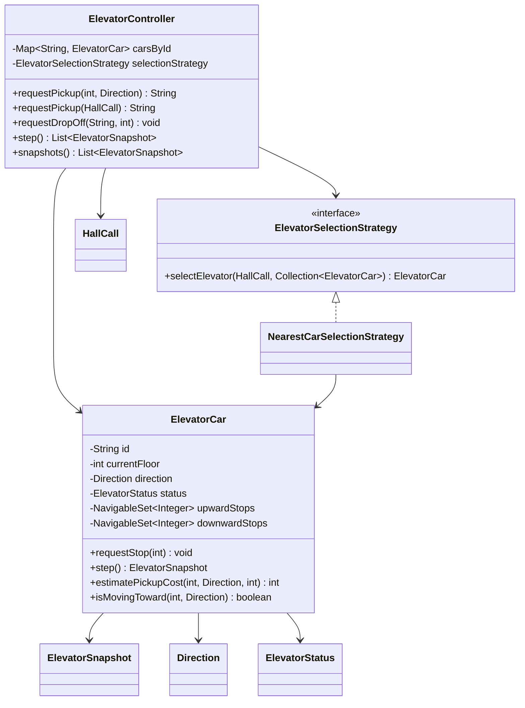
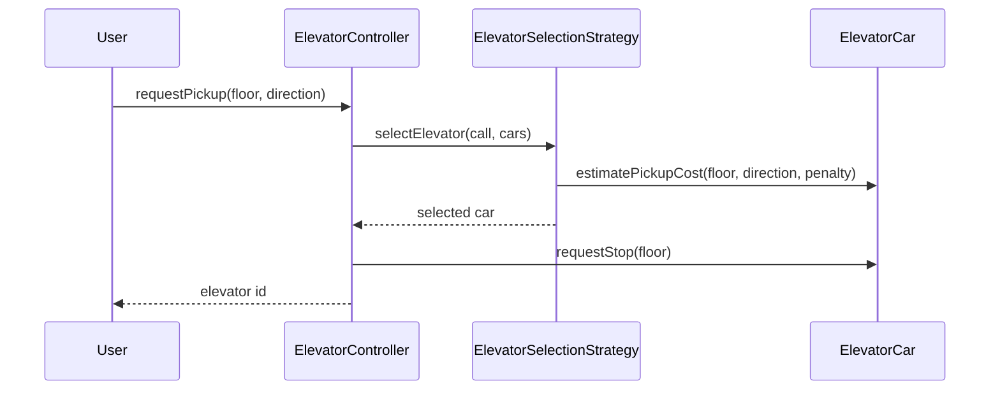
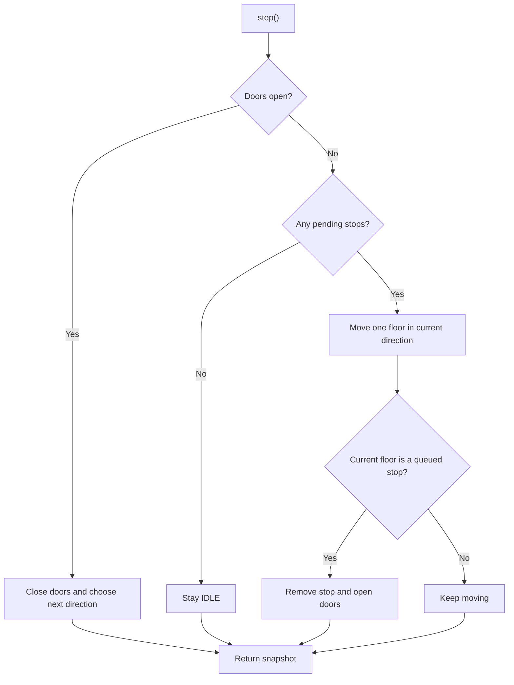

# Low-Level Design: Elevator System

## Interview Scope

Design an elevator dispatch system for a building with multiple elevator cars, hall calls, in-car destination requests, deterministic simulation ticks, and replaceable scheduling logic.

Functional requirements:

- Manage multiple elevator cars across a configured floor range.
- Accept hall calls with pickup floor and desired direction.
- Accept in-car drop-off requests.
- Move cars one step at a time for deterministic tests.
- Open and close doors at requested stops.
- Avoid assigning pickup calls to cars that cannot accept passengers.

Non-functional requirements:

- Scheduling policy must be replaceable.
- Car movement rules should remain independent from dispatch decisions.
- State snapshots should be immutable.
- Operations should be safe for concurrent callers in the in-memory implementation.

## Core Class Diagram

## Main Responsibilities

| Component | Responsibility |
| --- | --- |
| `ElevatorController` | Facade for pickup requests, drop-off requests, simulation, and snapshots. |
| `ElevatorCar` | Owns car-local state: floor, direction, status, capacity, and pending stops. |
| `ElevatorSelectionStrategy` | Assigns hall calls to a car. |
| `NearestCarSelectionStrategy` | Scores eligible cars by pickup cost and selects the cheapest. |
| `HallCall` | Immutable pickup request. |
| `ElevatorSnapshot` | Immutable state view for callers and tests. |

## Dispatch Flow

## Movement Flow

## Data Structures

| Need | Structure | Reason |
| --- | --- | --- |
| Stable car registry | `LinkedHashMap<String, ElevatorCar>` | Deterministic iteration and snapshots. |
| Upward stops | `TreeSet<Integer>` ascending | Visit higher floors in increasing order. |
| Downward stops | `TreeSet<Integer>` descending | Visit lower floors in decreasing order. |
| State view | `ElevatorSnapshot` record | Prevent callers from mutating car internals. |

## Design Patterns

| Pattern | Where | Why it matters in interview discussion |
| --- | --- | --- |
| Strategy | `ElevatorSelectionStrategy` | Dispatch policy can change without changing car state transitions. |
| Facade | `ElevatorController` | Provides one API for callers and hides the car registry. |
| State | `ElevatorStatus`, `Direction`, car transition methods | Makes movement and door lifecycle explicit. |
| Snapshot / DTO | `ElevatorSnapshot` | Exposes read-only state safely. |
| Encapsulation | `ElevatorCar` owns stop queues | Prevents outside code from corrupting movement order. |

## Consistency and Concurrency

`ElevatorController` synchronizes operations that assign calls, add drop-offs, and advance the simulation. `ElevatorCar` also synchronizes car-local operations. This keeps the in-memory demo safe while avoiding exposed mutable collections.

Important invariants:

- A car never accepts a stop outside its floor range.
- A pickup is assigned only to an eligible car.
- Direction reverses only when the current direction has no remaining stops.
- Snapshots return copies of pending stops.

## Extension Points

- Replace `NearestCarSelectionStrategy` with ETA-based, zoning, or destination-dispatch strategies.
- Add maintenance mode by adding car availability and filtering in the strategy.
- Add door dwell time by replacing the single open-door tick with a countdown.
- Add emergency override with a high-priority state and stop queue.
- Add capacity-aware boarding by modeling passengers and destinations.

## Interview Talking Points

- Keep scheduling and movement separate; otherwise every new dispatch strategy risks breaking car mechanics.
- `TreeSet` is enough for basic SCAN-style movement, but ETA-based systems need richer queue simulation.
- A production controller would likely shard by building or elevator bank and persist commands/events.
