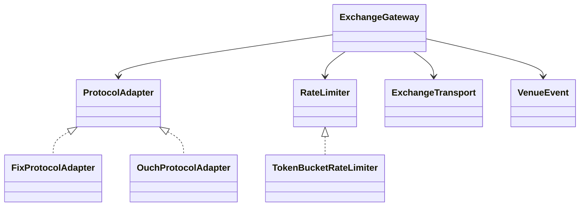
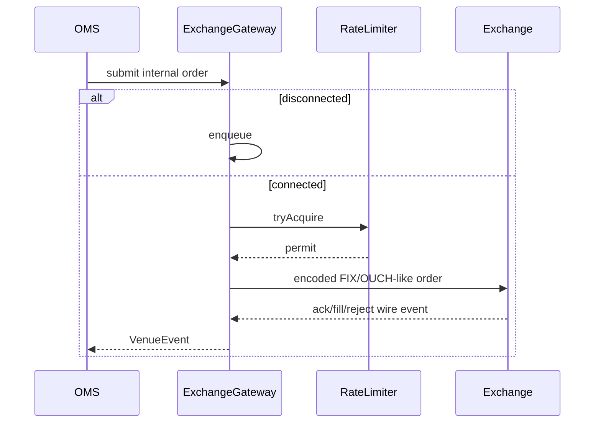

# Exchange Gateway — 40–60 Minute LLD

## Scope (0–10 min)

Translate protocol-neutral internal orders to one venue protocol, throttle outbound traffic, send through a transport, convert acknowledgements/executions back to domain events, and recover queued work after reconnect. Session sequencing itself is delegated to the separate FIX Session Manager.

## Design (10–28 min)

Adapter isolates wire formats; Strategy isolates throttling; `ExchangeTransport` is a Port for TCP/session infrastructure; the gateway is the Facade/orchestrator. The reconnect queue owns orders accepted while transport is down.

## Flow (28–42 min)

On reconnect, FIFO queued orders flush only while permits are available; `flush()` continues later. Duplicate internal IDs fail fast.

## Trade-offs (42–55 min)

- Live throttled and disconnected submissions enter the same FIFO outbound queue. A production API must bound this queue and define timeout/backpressure behavior.
- Persist the outbox before accepting, attach idempotency/correlation IDs, distinguish sent-but-unacknowledged orders, reconcile on reconnect, and never blindly resend without venue semantics.
- Add per-message rate classes, cancel priority, circuit breaker, session health, raw-message audit with secrets redacted, latency/queue metrics, and dead-letter handling.
- FIX/OUCH encodings are intentionally simplified teaching formats, not protocol-compliant wire engines.

## Tests (55–60 min)

Tests cover both adapters, ack/fill publication, disconnected queuing/reconnect flush, live throttling, and deterministic token refill.
