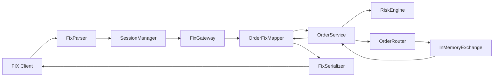
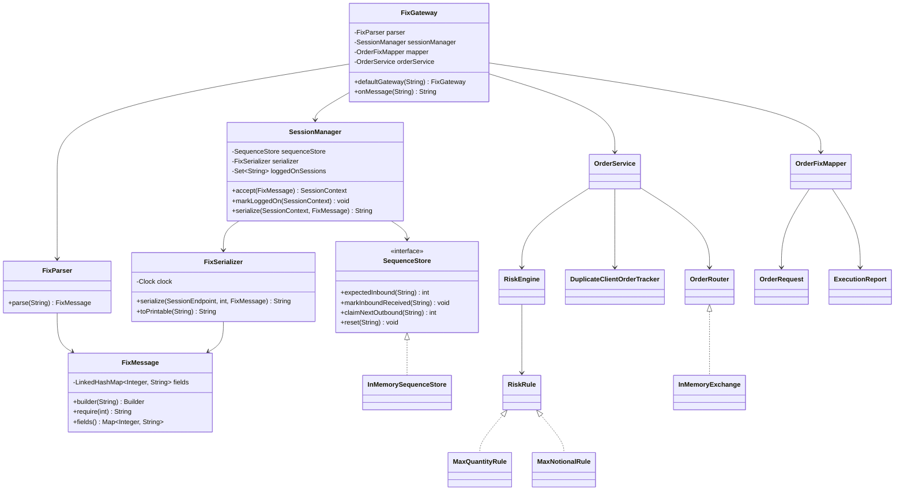
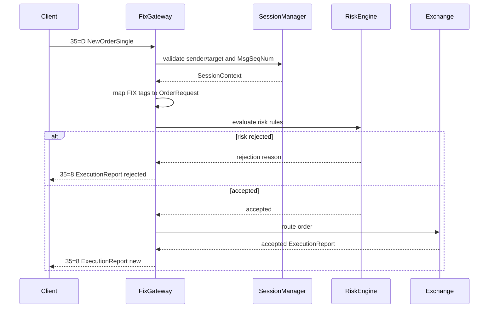

# FIX Gateway Low-Level Design

## Goals

The gateway receives FIX messages from buy-side or internal trading clients, enforces session rules, converts order messages into domain objects, applies risk checks, routes accepted orders to an exchange adapter, and converts exchange responses back into FIX execution reports.

## Non-goals

- Raw TCP acceptor loop.
- TLS and authentication beyond FIX sender/target validation.
- Durable order store.
- FIX resend/replay store.
- Repeating groups and allocation messages.
- Market data.

These are important in production but are deliberately separated from the core LLD model.

## Components

## Class Diagram

## Main classes

| Class | Responsibility |
| --- | --- |
| `FixMessage` | Immutable tag-value model for a parsed FIX message. |
| `FixParser` | Parses SOH or pipe-delimited FIX messages and validates body length/checksum when present. |
| `FixSerializer` | Builds FIX.4.4 messages with generated sequence number, sending time, body length, and checksum. |
| `SessionManager` | Validates sender/target IDs, enforces inbound sequence numbers, and assigns outbound sequence numbers. |
| `FixGateway` | Application service that dispatches supported FIX message types. |
| `OrderFixMapper` | Converts FIX `NewOrderSingle` messages into `OrderRequest` and `ExecutionReport` objects back into FIX. |
| `OrderService` | Coordinates idempotency, risk checks, and routing. |
| `RiskEngine` | Runs ordered `RiskRule` strategies and returns the first rejection. |
| `OrderRouter` | Port for routing accepted orders to a venue/exchange. |
| `InMemoryExchange` | Adapter used by the demo and tests. |

## Design patterns

| Pattern | Where | Why |
| --- | --- | --- |
| Strategy | `RiskRule` implementations | Add or remove checks without changing order flow. |
| Adapter | `OrderRouter` / `InMemoryExchange` | Keep exchange-specific integration behind a stable port. |
| Repository-like store | `SequenceStore`, `DuplicateClientOrderTracker` | Hide session/order state storage behind focused abstractions. |
| Mapper | `OrderFixMapper` | Keep FIX tag details out of domain and service logic. |
| Facade | `FixGateway` | Provide one entry point for inbound raw FIX messages. |

## New order flow

## Sequence number behavior

- Inbound sequence numbers are tracked per client session ID: `clientCompId->gatewayCompId`.
- The first inbound message is expected to have `34=1`.
- Every accepted inbound message increments the expected inbound sequence number.
- Outbound sequence numbers are generated per client session and start from `1`.
- A wrong inbound sequence number fails fast with `SequenceException`.

## Important tradeoffs

- Duplicate `ClOrdID` values are reserved even if a later risk rule rejects the order. This mirrors conservative trading-system behavior where client order IDs should remain unique after use.
- Invalid order fields that cannot produce a meaningful `ExecutionReport` become session rejects. Risk failures for valid orders produce business-level execution report rejects.
- The code uses in-memory stores to keep the LLD runnable without external services. `SequenceStore`, `DuplicateClientOrderTracker`, and `OrderRouter` are the extension points for durable stores and real exchange adapters.
