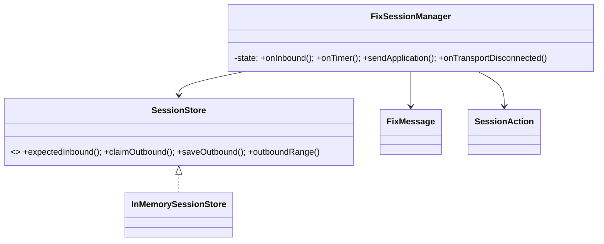
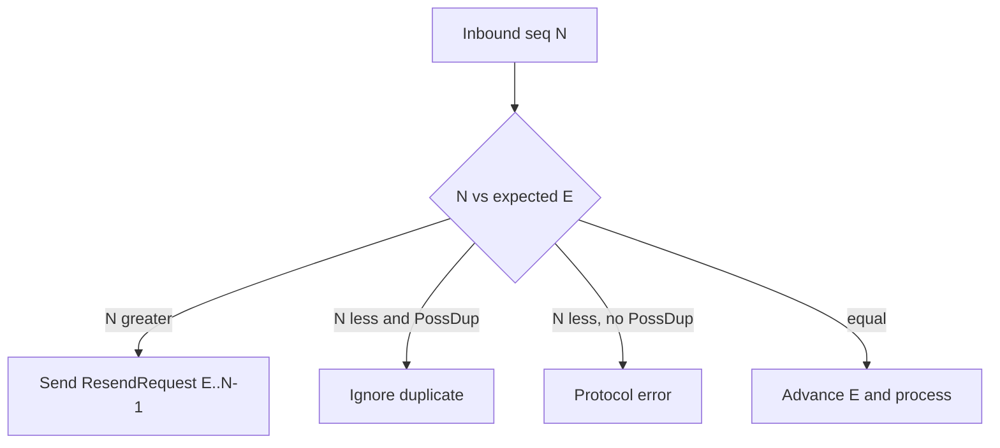

# FIX Session Manager — 40–60 Minute LLD

## Scope (0–10 min)

Separate session reliability from business order handling. The manager validates sequence numbers, performs logon/heartbeat/logout, detects gaps and duplicates, retains outbound messages for resend, and restores sequence state after reconnect. `FixMessage` is a typed teaching model; wire parsing/checksum belongs outside this module.

## Classes (10–25 min)

`SessionStore` is Repository/Port; the in-memory implementation is replaceable by a journal/database. `SessionAction` keeps transport and application callbacks outside the state machine.

## Sequence behavior (25–42 min)

Inbound gaps do not advance expected sequence. An inbound resend request reads the outbound journal and returns replay actions marked possible-duplicate. `end=0` means through the latest stored outbound sequence. Heartbeats are clock-driven and use the same outbound sequencer.

## Recovery and trade-offs (42–55 min)

Keep the store outside the connection object. After transport loss, a new manager shares/restores the store and logs on at the next expected inbound/outbound numbers. Production adds durable write-before-send, ResetSeqNumFlag negotiation, SequenceReset/GapFill, TestRequest and timeout detection, compaction, calendar/session IDs, raw bytes for exact replay, TLS, and authentication.

## Tests (55–60 min)

Executable tests cover logon/heartbeat, gap requests, duplicate suppression, replay, and reconnect sequence continuity.
