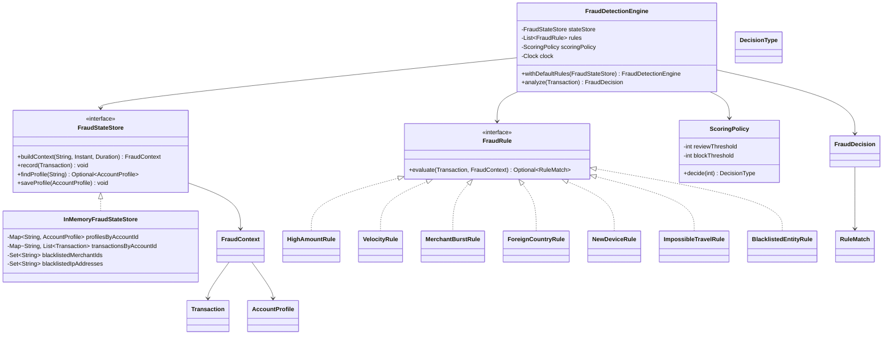
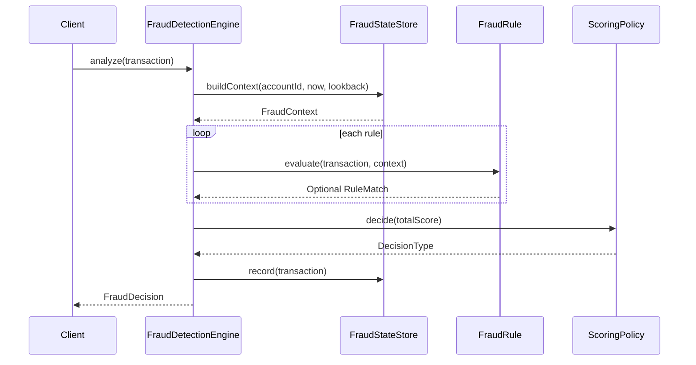

# Low-Level Design: Fraud Pattern Detection

## Interview Scope

Design a fraud detection engine that evaluates incoming payment transactions with composable rules, stateful account context, scoring, and an explainable decision.

Functional requirements:

- Evaluate each transaction before it is recorded.
- Load account profile and recent transaction history.
- Detect high amount, velocity, merchant burst, foreign country, new device, impossible travel, and blacklisted entity patterns.
- Combine rule matches into a risk score.
- Return `APPROVE`, `REVIEW`, or `BLOCK`.
- Preserve matched-rule explanations for audit and support.

Non-functional requirements:

- Rules should be independently testable.
- The state store should be replaceable.
- Rule output should be explainable and deterministic.
- Time-window rules should be testable with an injected clock.

## Core Class Diagram

## Main Responsibilities

| Component | Responsibility |
| --- | --- |
| `FraudDetectionEngine` | Orchestrates context loading, rule evaluation, scoring, decision creation, and state recording. |
| `FraudStateStore` | Port for profiles, recent transactions, and blacklist state. |
| `InMemoryFraudStateStore` | Demo implementation backed by maps, lists, and sets. |
| `FraudRule` | Interface for independently testable fraud signals. |
| `RuleMatch` | Explains which rule matched, why, and how much score it contributed. |
| `ScoringPolicy` | Maps accumulated risk score to final decision. |
| `FraudDecision` | Immutable result containing transaction id, decision type, score, matches, and timestamp. |

## Analyze Flow

## Rule Model

| Rule | Signal |
| --- | --- |
| `HighAmountRule` | Transaction amount exceeds a configured threshold. |
| `VelocityRule` | Too many recent transactions in a rolling time window. |
| `MerchantBurstRule` | Too many recent transactions at the same merchant. |
| `ForeignCountryRule` | Transaction country differs from the account home country. |
| `NewDeviceRule` | Device id is not known for the account. |
| `ImpossibleTravelRule` | Country changed faster than the configured travel-time threshold. |
| `BlacklistedEntityRule` | Merchant or IP address appears in blacklist state. |

## Design Patterns

| Pattern | Where | Why it matters in interview discussion |
| --- | --- | --- |
| Strategy | `FraudRule` implementations | New fraud signals can be added without changing engine orchestration. |
| Pipeline / Chain | Ordered rule list inside `FraudDetectionEngine` | The transaction passes through independent rule evaluators. |
| Repository / Port | `FraudStateStore` | State source can move from memory to Redis, Kafka Streams, or SQL. |
| Policy Object | `ScoringPolicy` | Threshold decisions are isolated from individual rules. |
| Value Object / DTO | `Transaction`, `FraudContext`, `RuleMatch`, `FraudDecision` | Keeps rule inputs and outputs explicit and explainable. |

## Consistency and State

Important ordering:

1. Build context from prior transactions.
2. Evaluate rules against the incoming transaction plus prior context.
3. Score and produce the decision.
4. Record the transaction after the decision is made.

This avoids allowing the current transaction to pollute velocity or burst calculations as historical state.

Production considerations:

- Use per-account ordering to avoid race conditions for fast repeated transactions.
- Store decisions separately from transactions for audit.
- Keep blacklist updates versioned.
- Make rules configurable by tenant, market, or payment rail.

## Extension Points

- Add a machine-learning scorer behind a `ScoringPolicy`-like interface.
- Add rule severity and hard-block flags to `RuleMatch`.
- Add case management after `REVIEW` decisions.
- Add streaming state store for high-volume transaction ingestion.
- Add feature flags for enabling and disabling individual rules.

## Interview Talking Points

- Rules are strategies; the engine owns orchestration and score aggregation.
- Explainability is a first-class requirement, not an afterthought.
- Account-level ordering is the key scaling constraint for stateful fraud checks.
- Thresholds should be configuration, while rule code should remain deterministic and testable.
