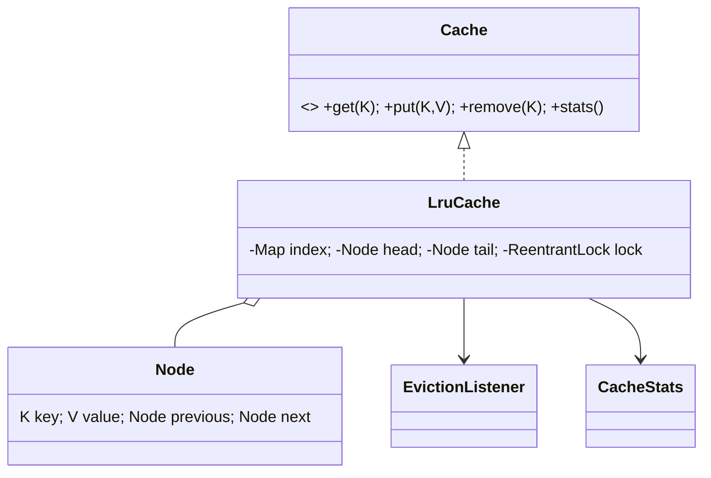
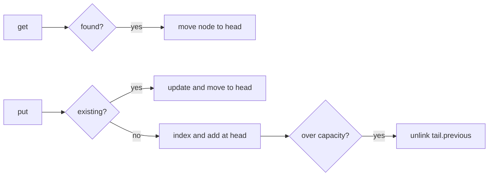

# LRU Cache — 40–60 Minute LLD

## Requirements/API (0–10 min)

Bounded generic cache with `get`, `put`, `remove`, `size`, stats, and eviction callback. A successful get or update makes the entry most recent. Null keys/values are rejected. Capacity is entry count.

## Data structures/classes (10–25 min)

The hash map locates a node in `O(1)`. A sentinel-based doubly linked list orders MRU→LRU and unlinks/moves nodes in `O(1)`. On overflow, evict `tail.previous`. This avoids `LinkedHashMap` to expose the interview data-structure reasoning.

## Operations (25–38 min)

## Thread safety/extensibility (38–55 min)

Every get mutates recency, so one `ReentrantLock` protects both map and list; this is simple and linearizable. The eviction listener runs after releasing the lock to prevent re-entrant callbacks/deadlocks. `Cache` and `EvictionListener` are extension seams; add a `Weigher`, loader, TTL policy, or admission policy without changing callers.

For higher throughput consider segmented LRUs (approximate global LRU), Caffeine-style admission/maintenance buffers, or read-optimized approximate recency. Define whether stats must be exact. Never call remote loaders while holding the structural lock.

## Tests (55–60 min)

Tests cover eviction order, update semantics, callbacks, invalid inputs, and concurrent structural/capacity invariants.
