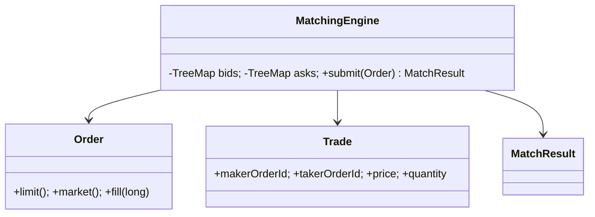
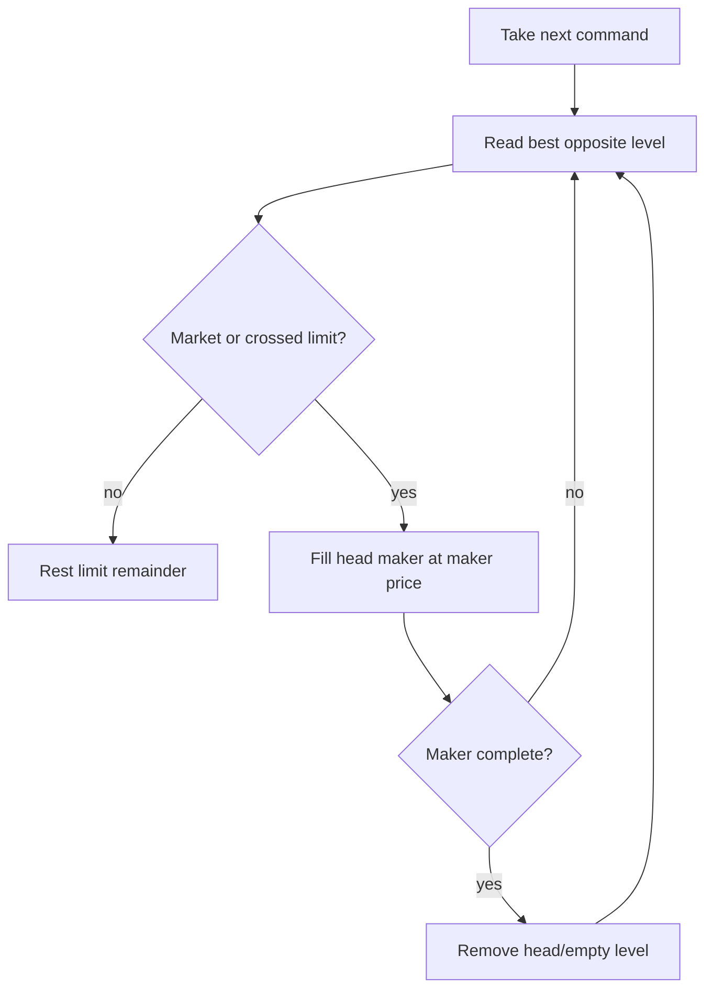

# Matching Engine — 40–60 Minute LLD

## Scope and API (0–8 min)

`submit(Order)` accepts LIMIT or MARKET orders. Best price wins; `Deque` FIFO wins at equal price; partial fills emit immutable `Trade` events; a limit remainder rests while a market remainder expires. Prices and quantities are integer units.

## Class diagram (8–18 min)

## Flow (18–35 min)

`TreeMap<Long, Deque<Order>>` gives `O(log P)` level insertion and best-level access; processing is `O(F + crossed levels)`. A single synchronized command path protects invariants and preserves determinism.

## Discussion (35–55 min)

- Aggregate: `MatchingEngine` exclusively owns mutable book state.
- Value objects: `Trade` and `MatchResult` are immutable outputs.
- Production: replace synchronization with a single-writer event loop per symbol/partition; journal commands before acknowledgement; replay for recovery; publish executions after sequencing.
- Explicit non-goals: cancel/replace (covered by Order Book), risk, OMS, networking, persistence, stop/iceberg orders, and self-trade prevention.

## Tests / follow-ups (55–60 min)

Tests prove best price, FIFO, maker price, partial fills, non-resting market remainder, and duplicate-ID rejection. Follow-ups: IOC/FOK, self-trade prevention, auction states, deterministic replay, and latency metrics.
