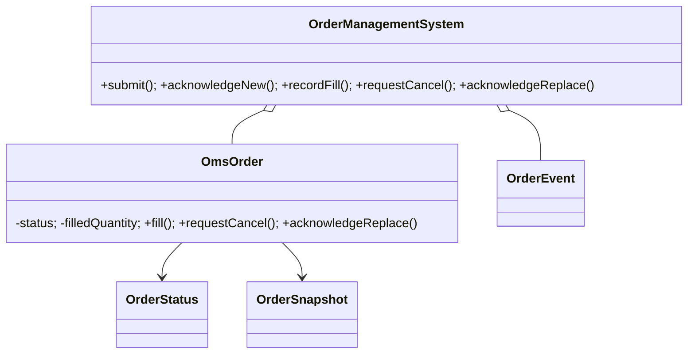
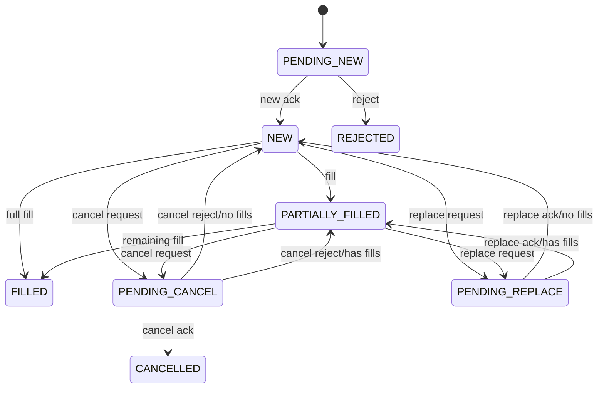

# OMS — 40–60 Minute LLD

## Clarify (0–10 min)

The OMS is the source of truth for client-visible order lifecycle, not a matching engine. It accepts commands and venue events, validates transitions, maintains cumulative/remaining quantity, and records an ordered audit history. Duplicate external execution handling and persistence are production follow-ups.

## Model (10–25 min)

`OmsOrder` is an Aggregate and state machine. `OrderManagementSystem` is a Facade/repository boundary. Snapshots/events are immutable value objects.

## State transitions (25–40 min)

Fills are permitted during pending cancel/replace because venue messages race. A full fill wins; a later cancel ack becomes invalid. Replace total quantity may not be below cumulative filled quantity.

## Reliability discussion (40–55 min)

Serialize mutations per order, use optimistic versions, persist event plus outbox atomically, deduplicate by execution ID and venue sequence, correlate client/original/replacement IDs, replay events after restart, and expose metrics for stuck pending states. A production state table may distinguish `EXPIRED`, `SUSPENDED`, and `DONE_FOR_DAY`.

## Executable proof (55–60 min)

Tests cover ack→partial fill→cancel, replacement after fills, a fill racing cancel, and invalid transitions.
