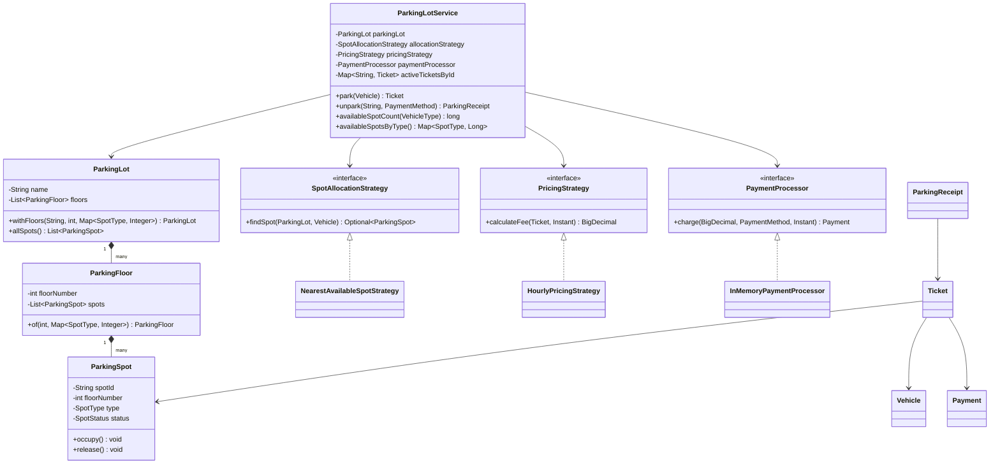
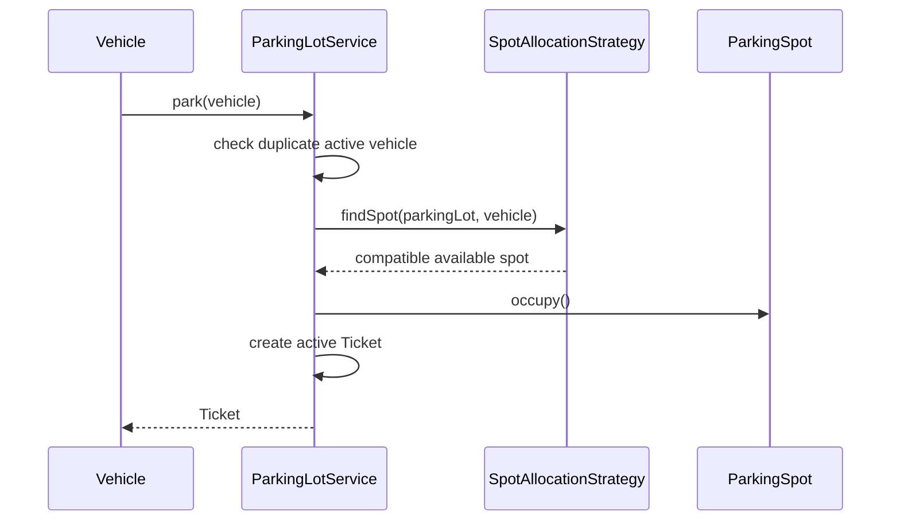
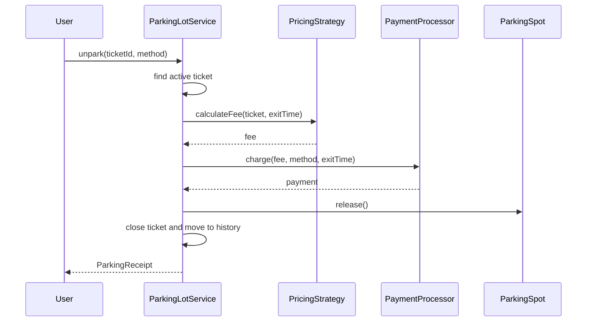

# Low-Level Design: Parking Lot

## Interview Scope

Design a parking lot that supports multiple floors, typed parking spots, vehicle compatibility, ticketing, payment, pricing, and availability queries.

Functional requirements:

- Park motorcycles, cars, electric cars, and trucks.
- Allocate a compatible available spot.
- Prevent the same vehicle from holding two active tickets.
- Generate a ticket at entry.
- Calculate parking fee at exit.
- Capture payment and release the spot.
- Query availability by vehicle or spot type.

Non-functional requirements:

- Allocation, pricing, and payment should be replaceable.
- In-memory state transitions should be consistent.
- The service should expose a small workflow-focused API.

## Core Class Diagram

## Main Responsibilities

| Component | Responsibility |
| --- | --- |
| `ParkingLotService` | Coordinates park, unpark, ticket lookup, availability, pricing, and payment. |
| `ParkingLot` | Aggregate of floors and all spots. |
| `ParkingFloor` | Groups spots on one floor and builds spot ids. |
| `ParkingSpot` | Owns spot type and occupied/free state. |
| `Ticket` | Tracks vehicle, assigned spot, entry time, exit time, fee, payment, and status. |
| `SpotAllocationStrategy` | Selects a compatible spot. |
| `PricingStrategy` | Computes fee from ticket and exit time. |
| `PaymentProcessor` | Captures payment outside core parking rules. |

## Park Flow

## Unpark Flow

## Design Patterns

| Pattern | Where | Why it matters in interview discussion |
| --- | --- | --- |
| Strategy | `SpotAllocationStrategy`, `PricingStrategy` | Allocation and pricing policies can evolve independently from parking workflow. |
| Adapter / Port | `PaymentProcessor` | Keeps payment-provider details outside the domain service. |
| Facade / Application Service | `ParkingLotService` | Provides one workflow API and hides internal indexes. |
| Factory Method | `ParkingLot.withFloors`, `ParkingFloor.of` | Builds consistent test/demo layouts. |
| State Machine | `TicketStatus`, `SpotStatus` | Makes ticket and spot lifecycle transitions explicit. |

## Data Consistency

`ParkingLotService` synchronizes workflow methods so the following invariants hold:

- One active ticket per vehicle license plate.
- A spot can be assigned only when it is available.
- A ticket moves from active to closed exactly once.
- Releasing a spot and closing a ticket happen in the same service operation.
- Closed tickets remain queryable separately from active tickets.

## Extension Points

- Add reserved parking by creating a new `SpotAllocationStrategy`.
- Add slab, weekend, or subscription pricing by creating another `PricingStrategy`.
- Add real payment integrations behind `PaymentProcessor`.
- Add EV charging metadata to `ParkingSpot` or a separate charging service.
- Add persistence with repositories for parking lots, tickets, and payments.

## Interview Talking Points

- Vehicle compatibility belongs in `SpotType.canFit(VehicleType)` so allocation strategies do not duplicate fit rules.
- Synchronized service methods are clear for LLD; production systems would use database transactions and row-level locks.
- Allocation can be optimized with per-floor availability indexes when scans become expensive.
