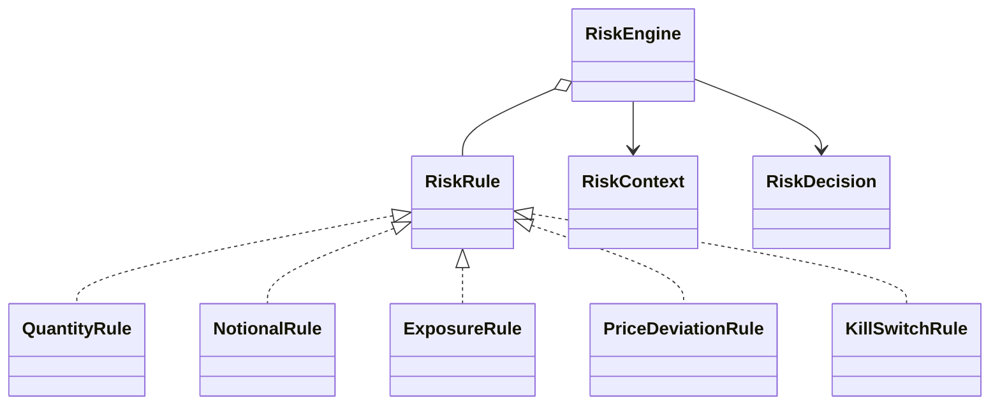
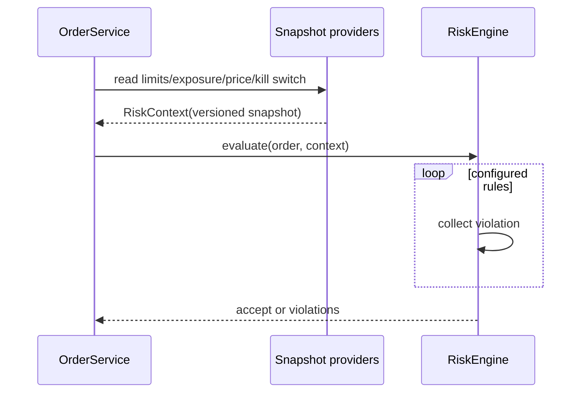

# Pre-Trade Risk Engine — 40–60 Minute LLD

## Requirements and boundaries (0–10 min)

Evaluate an immutable order against account limits and a point-in-time context before routing. Return an explainable decision containing every violated rule. Prices/notionals use integer minor units. Exposure is signed quantity in this teaching slice; production systems commonly use delta/notional by asset class.

## Design (10–25 min)

`RiskRule` is Strategy; `RiskEngine` is the ordered Composite/pipeline. `RiskContext` is a consistent snapshot containing current exposure, reference price, limits, and kill-switch state. Rules stay stateless and independently testable.

## Evaluation flow (25–40 min)

Rules: `qty <= maxQty`; `qty*price <= maxNotional`; `abs(current + signedQty) <= maxExposure`; `abs(limit-reference)*10000/reference <= maxDeviationBps`; reject if kill switch enabled.

## Concurrency and production trade-offs (40–55 min)

- A read-only evaluation is thread-safe. The caller must atomically reserve exposure after acceptance to avoid two concurrent orders both passing against stale exposure.
- Use versioned snapshots, compare-and-set reservations, idempotent order IDs, overflow-safe decimal math, per-instrument reference-price freshness, configuration audit, metrics, and fail-closed policy where required.
- Policy order can short-circuit for latency; collecting all failures is more explainable. This implementation collects all.

## Tests (55–60 min)

Happy path, aggregate failures, exposure-reducing sell, and custom-rule plug-in are executable. Non-goals: durable reservation ledger, portfolio Greeks, auth, networking, and market-data ingestion.
