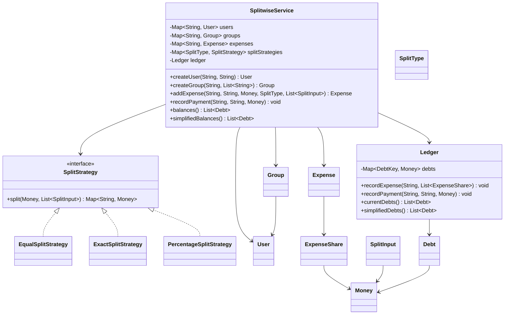
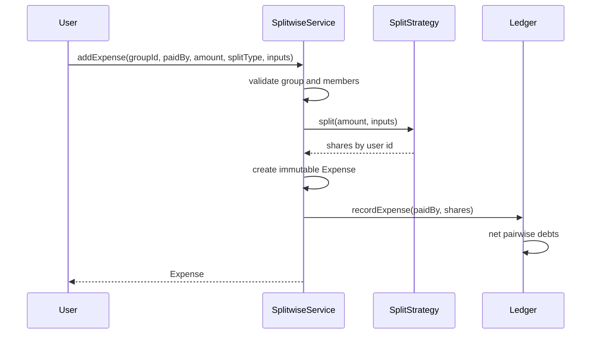

# Low-Level Design: Splitwise

## Interview Scope

Design an expense-sharing service that supports groups, split types, balance tracking, payments, and simplified settlements.

Functional requirements:

- Create users and groups.
- Add expenses paid by one user and owed by one or more users.
- Support equal, exact, and percentage split types.
- Maintain pairwise debts after expenses and payments.
- Record payments to settle balances.
- Produce simplified settlements with fewer transactions.

Non-functional requirements:

- Money calculations must preserve currency and two-decimal precision.
- Split calculation should be replaceable.
- Expense history should be immutable.
- Balance updates should be deterministic and testable.

## Core Class Diagram



## Main Responsibilities

| Component | Responsibility |
| --- | --- |
| `SplitwiseService` | Application facade for user, group, expense, payment, and balance operations. |
| `SplitStrategy` | Calculates owed shares for a split type. |
| `EqualSplitStrategy` | Divides total evenly and handles rounding residue deterministically. |
| `ExactSplitStrategy` | Validates exact amounts sum to the expense total. |
| `PercentageSplitStrategy` | Validates percentages and converts them into exact money shares. |
| `Ledger` | Maintains net pairwise debts and simplifies settlements. |
| `Money` | Value object for currency-safe arithmetic. |

## Add Expense Flow



## Ledger Model

The ledger stores pairwise net debts:

```text
(fromUserId, toUserId) -> Money
```

When an expense is recorded, every participant except the payer owes the payer their calculated share. If the reverse debt already exists, the ledger nets the amounts immediately.

Simplification works per currency:

1. Convert pairwise debts into net user balances.
2. Put debtors and creditors into priority queues ordered by amount.
3. Match largest debtor to largest creditor until all balances are settled.

## Design Patterns

| Pattern | Where | Why it matters in interview discussion |
| --- | --- | --- |
| Strategy | `SplitStrategy` implementations | New split modes can be added without modifying `SplitwiseService`. |
| Facade / Application Service | `SplitwiseService` | Keeps validation, storage, and ledger updates behind one API. |
| Domain Service | `Ledger` | Encapsulates balance netting and settlement simplification. |
| Value Object | `Money` | Protects currency consistency and decimal precision. |
| Immutable Event | `Expense`, `ExpenseShare`, `Debt` records | Keeps transaction history separate from mutable balances. |

## Invariants

- Every expense payer must be a member of the group.
- Every split participant must be a member of the group.
- Exact splits must sum to the total amount.
- Percentage splits must sum to 100.
- Money operations require matching currencies.
- Ledger simplification never mixes currencies.

## Extension Points

- Add shares-based split using another `SplitStrategy`.
- Add comments, attachments, and audit history around immutable `Expense`.
- Add repository interfaces for persistence.
- Add recurring expenses as a scheduler that calls `addExpense`.
- Add notifications after ledger updates.

## Interview Talking Points

- Expense history is immutable; balances are derived mutable state inside `Ledger`.
- `Money` is deliberately a first-class type because plain `BigDecimal` allows currency mistakes.
- Settlement simplification is a greedy debtor-creditor matching problem and is separate from pairwise debt storage.
