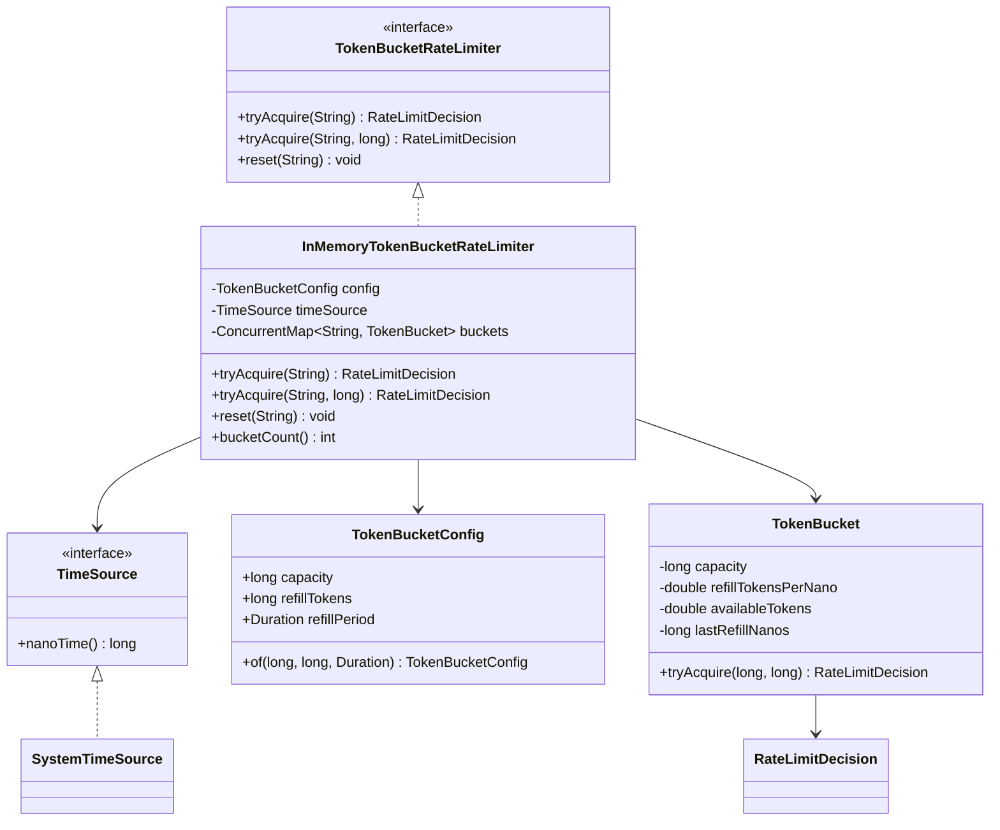
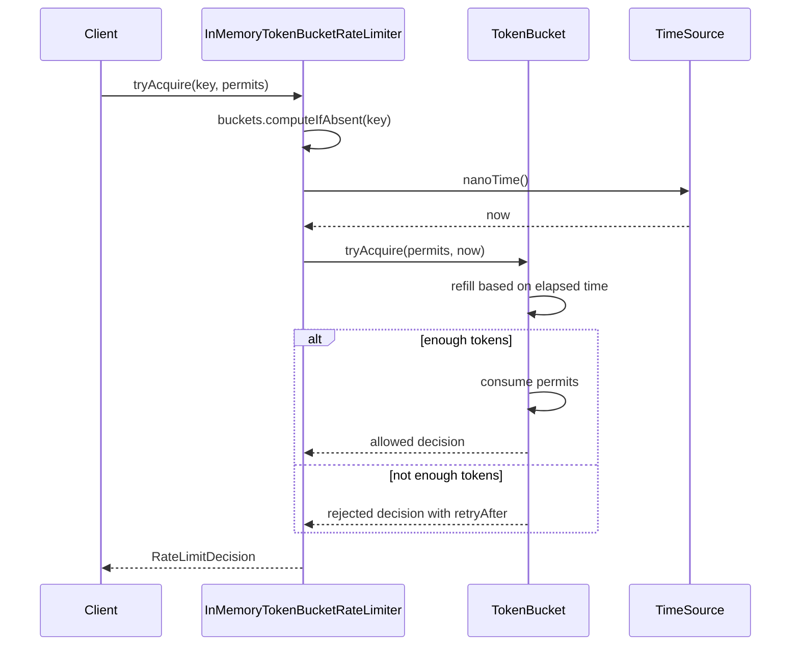

# Low-Level Design: Token Bucket Rate Limiter

## Interview Scope

Design a thread-safe in-memory token bucket rate limiter that supports independent buckets per key, burst capacity, lazy refill, and retry-after hints.

Functional requirements:

- Allow a burst up to configured bucket capacity.
- Refill tokens over time at a configured rate.
- Track independent buckets per user, API key, IP address, or any caller-provided key.
- Allow requests for one or more permits.
- Return whether the request is allowed, remaining tokens, and retry-after duration.
- Reset a bucket when needed.

Non-functional requirements:

- `tryAcquire` should be `O(1)` average time.
- Concurrent requests to different keys should not block each other.
- Time should be injectable for deterministic tests.
- The public API should hide bucket internals.

## Core Class Diagram



## Main Responsibilities

| Component | Responsibility |
| --- | --- |
| `TokenBucketRateLimiter` | Public interface for acquiring permits and resetting keys. |
| `InMemoryTokenBucketRateLimiter` | Manages the per-key bucket map and delegates bucket math. |
| `TokenBucket` | Owns per-key token count, refill math, and synchronized mutation. |
| `TokenBucketConfig` | Immutable capacity and refill configuration. |
| `TimeSource` | Abstraction over nanosecond time for production and tests. |
| `RateLimitDecision` | Immutable result returned to callers. |

## Request Flow



## Token Bucket Math

Each bucket tracks:

```text
capacity
availableTokens
refillTokensPerNano = refillTokens / refillPeriodNanos
lastRefillNanos
```

On each request:

1. Compute elapsed nanoseconds since `lastRefillNanos`.
2. Add `elapsed * refillTokensPerNano` to `availableTokens`.
3. Cap `availableTokens` at `capacity`.
4. If `availableTokens >= permits`, subtract permits and allow.
5. Otherwise compute retry-after from the token deficit.

## Design Patterns

| Pattern | Where | Why it matters in interview discussion |
| --- | --- | --- |
| Facade / Port | `TokenBucketRateLimiter` | Callers depend on a stable rate-limiter API. |
| Encapsulation | `TokenBucket` | Refill and consumption state cannot be mutated outside the bucket. |
| Strategy / Port | `TimeSource` | Production and tests can supply different time sources. |
| Value Object | `TokenBucketConfig`, `RateLimitDecision` | Immutable config and result keep the API predictable. |
| Lazy Initialization | `computeIfAbsent` in `InMemoryTokenBucketRateLimiter` | Buckets are created only for active keys. |

## Concurrency

The implementation avoids a global request lock:

- `ConcurrentHashMap` protects bucket lookup and creation.
- Each `TokenBucket` synchronizes `tryAcquire`.
- Requests for different keys proceed independently.
- Requests for the same key serialize so token math remains correct.

Tradeoffs:

- Space grows with distinct keys until reset or cleanup is added.
- Per-key synchronization is enough for a single JVM.
- Distributed rate limiting needs Redis, a database counter, or a token service.

## Extension Points

- Add bucket expiry for inactive keys.
- Add hierarchical limits, such as user plus organization.
- Add distributed backing storage.
- Add leaky bucket or fixed-window implementations behind the same interface.
- Add metrics for allowed, rejected, and retry-after distributions.

## Interview Talking Points

- Token bucket allows bursts; leaky bucket smooths traffic more strictly.
- Lazy refill avoids background scheduler complexity.
- Per-key locking is the important concurrency design choice.
- Retry-after should be derived from deficit and refill rate, not guessed.
