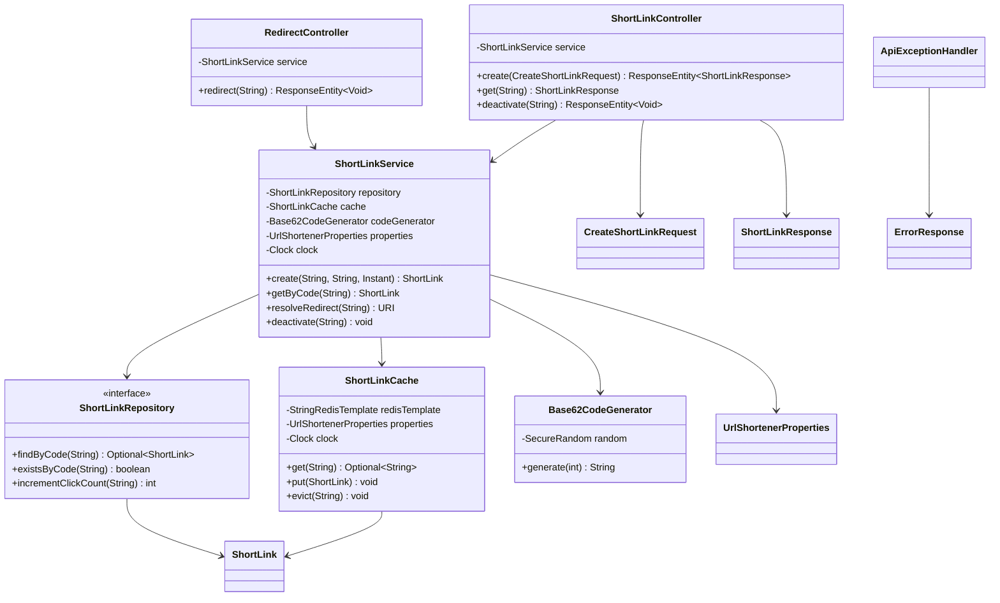
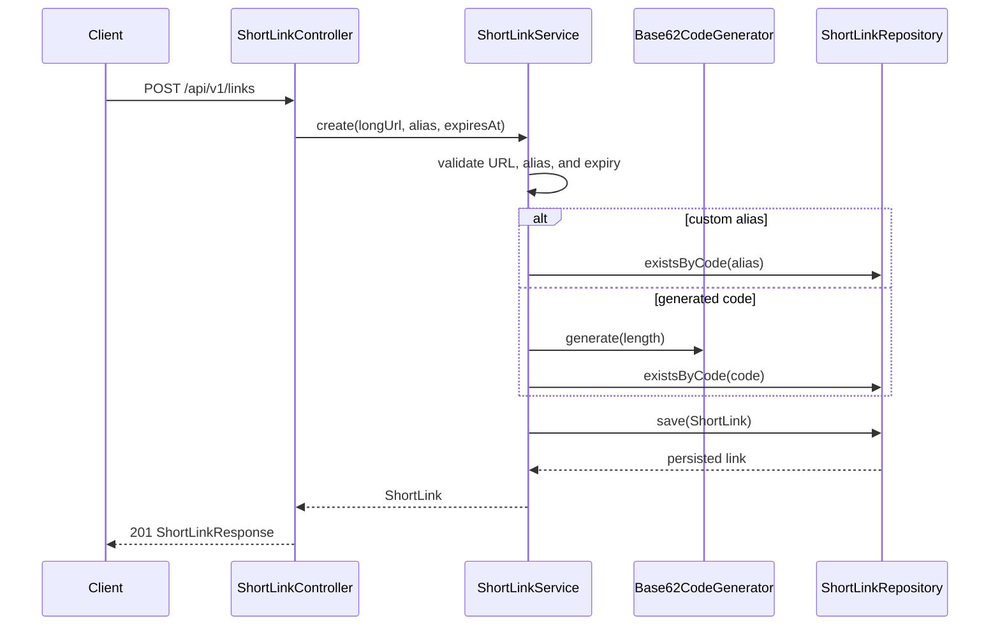
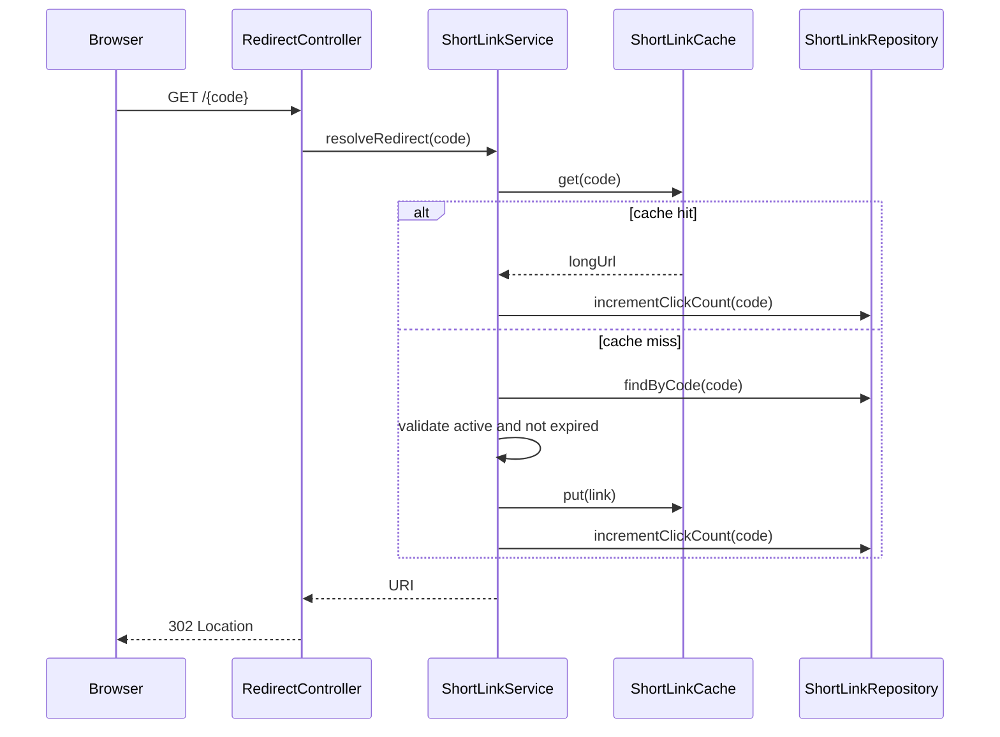

# Low-Level Design: URL Shortener

## Interview Scope

Design a URL shortener with REST APIs, custom aliases, generated Base62 codes, redirect caching, expiry, soft delete, and database-backed uniqueness.

Functional requirements:

- Create a short link for a valid HTTP or HTTPS URL.
- Support optional custom alias.
- Support optional expiry time.
- Redirect by short code.
- Fetch link metadata.
- Deactivate a short link.
- Count redirects on a best-effort basis.

Non-functional requirements:

- MySQL is the source of truth.
- Redis is a cache-aside optimization for redirect reads.
- Generated code collisions should retry safely.
- Custom aliases should be unique.
- Redis failures should not make the source-of-truth API unavailable.

## Core Class Diagram

## Main Responsibilities

| Component | Responsibility |
| --- | --- |
| `ShortLinkController` | Admin-style create, read, and deactivate REST endpoints. |
| `RedirectController` | Public `/{code}` redirect endpoint. |
| `ShortLinkService` | Validates input, allocates codes, resolves redirects, handles expiry, updates cache, and increments clicks. |
| `ShortLinkRepository` | JPA persistence for source-of-truth MySQL rows. |
| `ShortLinkCache` | Redis cache-aside wrapper with graceful failure behavior. |
| `Base62CodeGenerator` | Generates random URL-safe short codes. |
| `ApiExceptionHandler` | Maps domain exceptions to HTTP responses. |

## Create Flow

## Redirect Flow

## Database Model

`short_links` is the source-of-truth table.

| Column | Purpose |
| --- | --- |
| `id` | Internal primary key. |
| `code` | Public short code with a unique index. |
| `long_url` | Original URL. |
| `created_at` | Creation timestamp. |
| `expires_at` | Optional expiry. |
| `active` | Soft-delete flag. |
| `click_count` | Best-effort redirect counter. |
| `version` | Optimistic locking support. |

## Design Patterns

| Pattern | Where | Why it matters in interview discussion |
| --- | --- | --- |
| Layered Architecture | Controllers, service, repository, cache | Separates API, business rules, persistence, and caching. |
| Repository | `ShortLinkRepository` | Hides JPA and SQL details from business logic. |
| Cache-Aside | `ShortLinkCache` plus `ShortLinkService.resolveRedirect` | Redis accelerates hot redirects while MySQL remains authoritative. |
| Strategy-like Generator | `Base62CodeGenerator` | Code allocation can be replaced by counter, Snowflake, hash, or range allocator. |
| DTO | Request and response records | Keeps REST payloads separate from the JPA entity. |
| Exception Mapper | `ApiExceptionHandler` | Centralizes domain-to-HTTP error translation. |

## Consistency and Failure Handling

Important invariants:

- `code` is unique in MySQL.
- Only active, non-expired links redirect.
- Deactivation evicts Redis.
- Expiring links are cached only until their expiry time.
- Redis failures are treated as misses; MySQL remains the source of truth.

Tradeoffs:

- Random code generation is simple but must retry on collision.
- Updating click count synchronously is easy but can become a write bottleneck.
- Redis hit with MySQL unavailable can still redirect, but click counting may be skipped.
- Cleanup of expired links is a background operational concern.

## Extension Points

- Add a `CodeGenerator` interface if multiple code allocation strategies are needed.
- Move click events to Kafka or Pub/Sub for asynchronous analytics.
- Add user ownership and access control.
- Add custom domain support.
- Add sharding by code hash when one MySQL primary becomes limiting.

## Interview Talking Points

- The redirect path is read-heavy and latency-sensitive, so Redis cache-aside is justified.
- The database unique constraint is the final guard for alias and generated-code collision correctness.
- Generated codes should not encode the long URL if privacy and enumeration resistance matter.
- Click counting is best-effort in this implementation; strict analytics needs an event pipeline.
